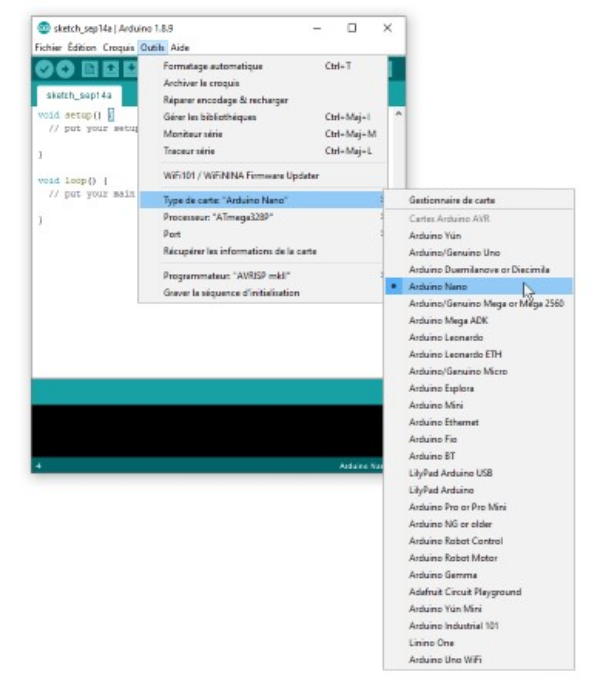
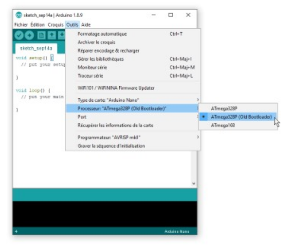

# Configuration de la carte Arduino Nano

## Installer le pilote de la carte Arduino Nano

* [Sparkfun : How to Install CH340 Drivers](https://learn.sparkfun.com/tutorials/how-to-install-ch340-drivers/all)

## Identifier le port de la carte Arduino Nano

## Configurer le logiciel Arduino pour la carte Arduino Nano

