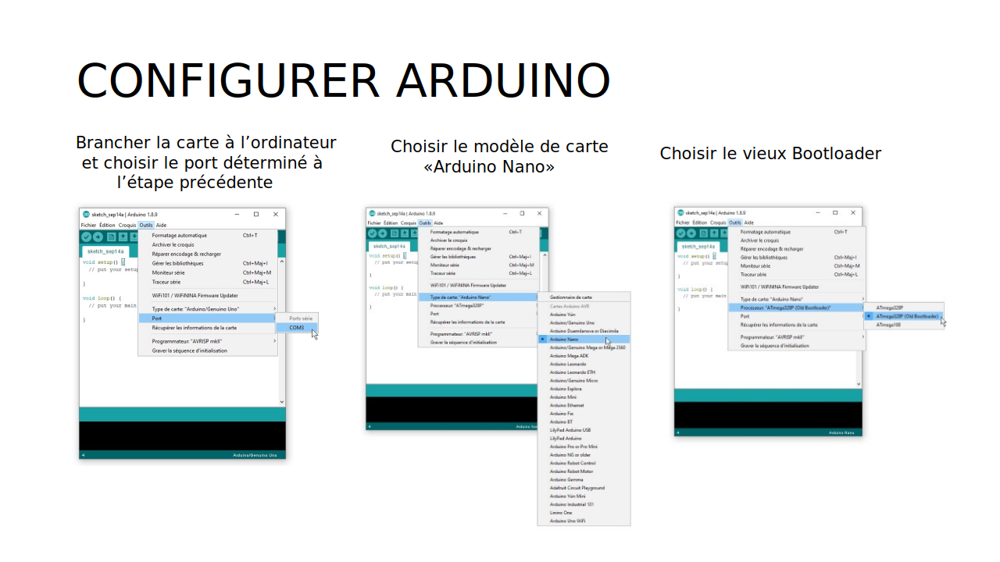

# Configuration de la carte Arduino Nano

## Installer le pilote

* [Sparkfun : How to Install CH340 Drivers](https://learn.sparkfun.com/tutorials/how-to-install-ch340-drivers/all)

## Identifier le porte de la carte 

## Configurer le logiciel Arduino

