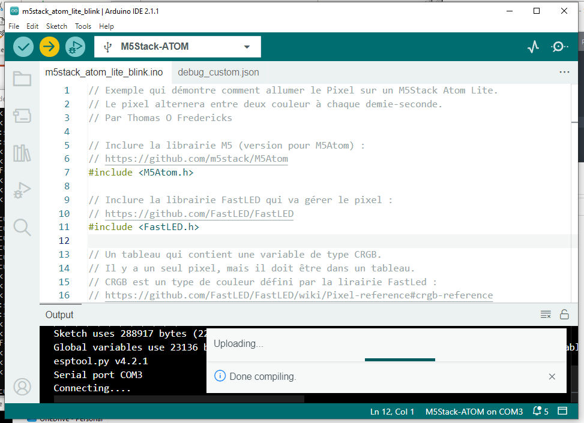

# Blink: le code test universel

## Code «Blink» pour M5Stack Atom Lite

### Remplacer le code dans un nouveaup document Arduino avec le code suivant 

```arduino
{{#include ./m5stack_atom_lite_blink/m5stack_atom_lite_blink.ino}}

```

### Lancer la compilation et le téléversement





## Code  «Blink» pour les modèles de carte classiques

### Ouvrir et téléverser l'exemple «0.1 Basics > Blink»


### Observer la DEL qui clignote


