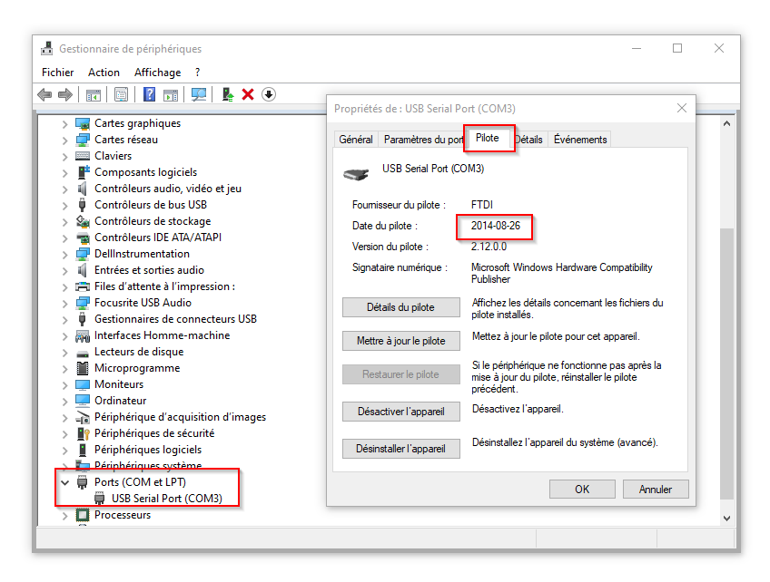
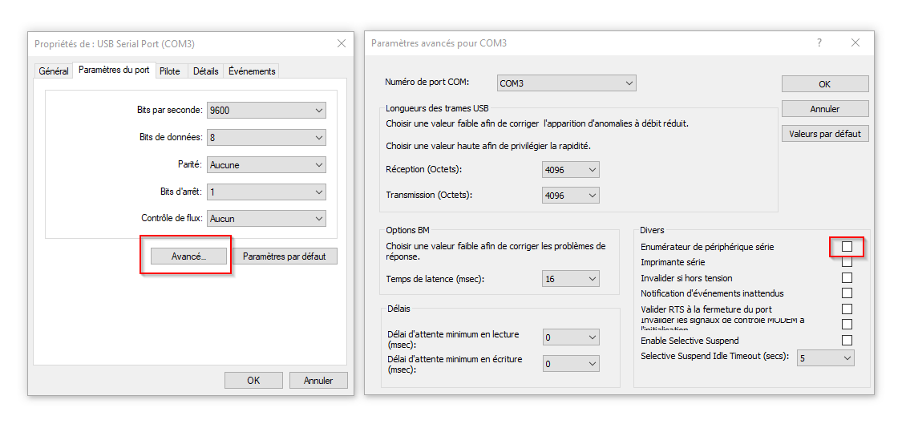

# Bogue de la souris qui saute

Il peut arriver avec certains pilotes USB que lorsque vous branchez l'Arduino à votre ordinateur *Windows*, que votre souris commence à sauter partout à l'écran et que vous perdez tout contrôle.

Par défaut, lors de l'énumération d'un port COM, Windows tente de détecter une souris sur le port série. Si des données sont transmises au PC depuis le port COM peu de temps après l'énumération, le PC interprète cela comme appartenant à une souris série et vous obtenez ainsi des sauts fous de souris.

## Modifier les pilotes

Premièrement, trouvez la version du pilote dans le gestionnaire de périphériques :


Téléchargez la version la plus à jour du pilote à l'adresse suivante  [https://ftdichip.com/Drivers/vcp-drivers/](https://ftdichip.com/Drivers/vcp-drivers/) et installez-la.

Profitez-en pour désactiver l'énumération série dans les propriétés avancés du pilote dans le gestionnaire de périphériques :



## Ajouter un délais

Une solution plus universelle et qui nécessite pas de modifier les pilotes consiste à ajouter un délais de cinq secondes dans l'exécution du code à la fin de la fonction `setup()` :

Ajoutez la ligne suivante à la toute fin de  `setup()` :
```arduino
delay(5000)
```

Alternativement, si vous utilisez un [M5Stack Atom](../m5stack/atom_lite.md) vous pouvez faire clignoter le pixel pour informer l'utilisateur que quelque chose se passe et la microcontrôleur démarre. Dans ce cas-là, ajoutez plutôt le code suivant à la toute fin de  `setup()` :
```arduino
  // ANIMATION DE DÉMARRAGE
  while ( millis() < 5000) {
    mesPixels[0] = CHSV( (millis()/5) % 255,255,255-(millis()*255/5000));
    FastLED.show();
    delay(50);
  } 
  mesPixels[0] = CRGB(0,0,0);
  FastLED.show();
```

## Références

* [arduino interferences the mouse - Software / Troubleshooting - Arduino Forum](https://forum.arduino.cc/t/arduino-interferences-the-mouse/49188/3)
* [Stack Overflow: Disable serial mouse in Windows](https://stackoverflow.com/questions/9226082/device-misdetected-as-serial-mouse)