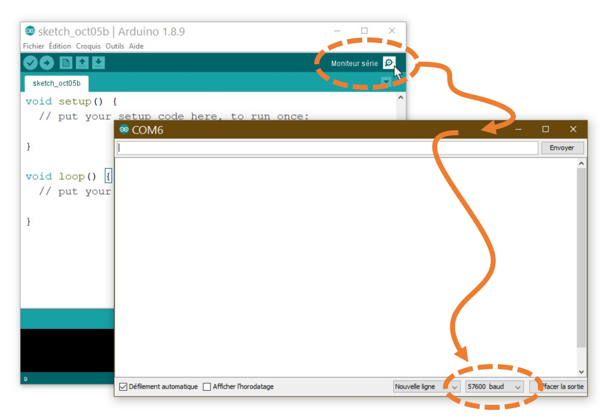
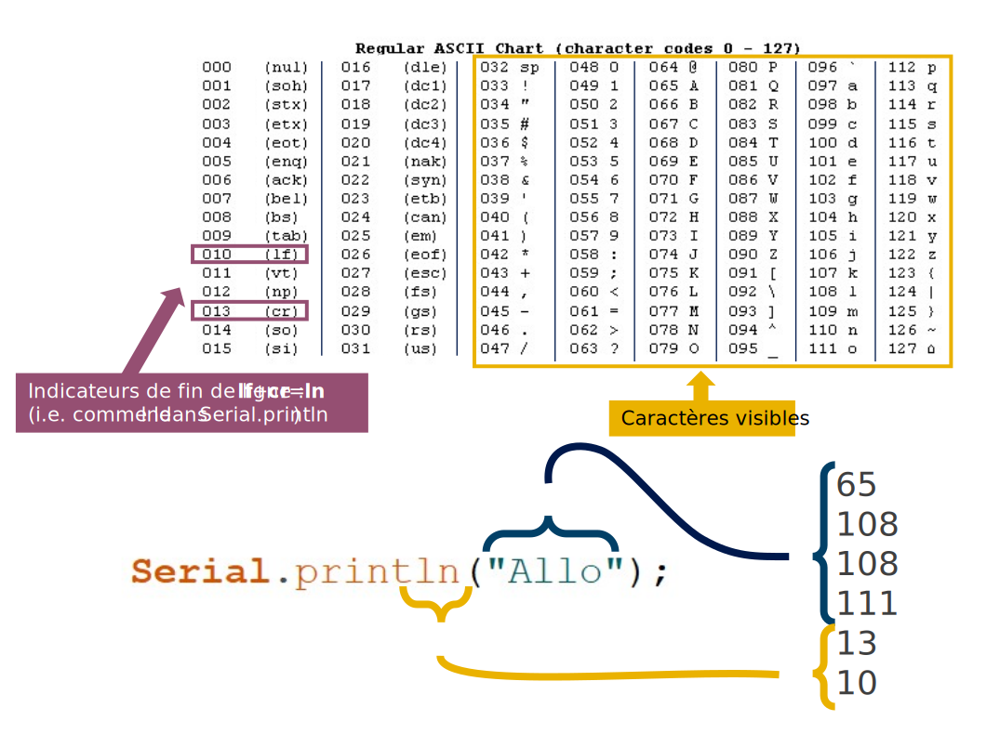

# Débogage

## Ouvrir et configurer le moniteur série

Le *baud* définit la vitesse de communication entre la carte et l’ordinateur. Plus le *baud* est rapide, plus on peut envoyer un grand nombre de messages. Une bonne valeur de *baud* a utiliser est **115200**. **Toutefois, il ne faut oublier que le plus important est que l’ordinateur et la carte utilisent le même *baud*!**

Quelques valeurs de *baud* communes : 300, 600, 1200, 2400, 4800, 9600, 14400, 19200, 28800, 38400, 57600, 115200 et +.



## Fonctions pour déboguer avec Serial

`Serial.begin(baud)` démarre la communication avec l’ordinateur :
```arduino
Serial.begin(57600);
```

`Serial.print()` envoie la valeur d'une variable à l’ordinateur une valeur en ASCII :
```arduino
Serial.print(maValeur);
```

`Serial.println()` envoie la valeur d'une variable à l’ordinateur une valeur en ASCII, suivi d’un retour à la ligne (ln) et d'un retour de chariot (cr) :
```arduino
Serial.println(maValeur);
```

`Serial.println()`  peut aussi être utilisé sans argument pour envoyer un retour à la ligne (ln) et un retour de chariot (cr) :
```arduino
Serial.println();
```

## Le code ASCII utilisé pour le débogage



## Exemple : déboguer une valeur qui incrémente

```arduino
int maValeurQuiIncremente = 0;

void setup() { // AU DÉMARRAGE
  Serial.begin(115200); // CONFIGURER LA COMMUNICATION SÉRIE
}

void loop() { // RÉPÉTER LE PLUS VITE POSSIBLE
  // INCRÉMENTER LA VALEUR DE LA VARIABLE :
  maValeurQuiIncremente = maValeurQuiIncremente + 1;
  // SI LA VALEUR EST UN MULTIPLE DE 1000 (% représente l'opération d'un MODULO) :
  if ( maValeurQuiIncremente % 1000 == 0) {
     // ENVOYER LA VALEUR :
     Serial.print( maValeurQuiIncremente );
     // TERMINER LE MESSAGE
     Serial.println(); 
  }
}
```
