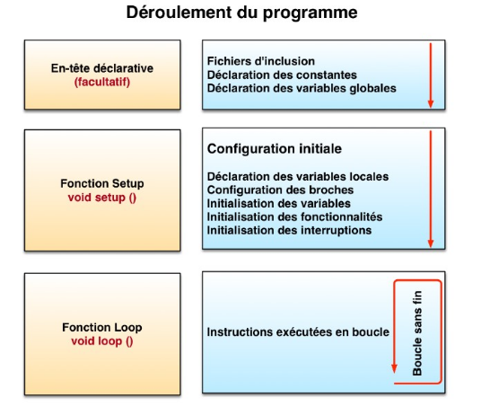
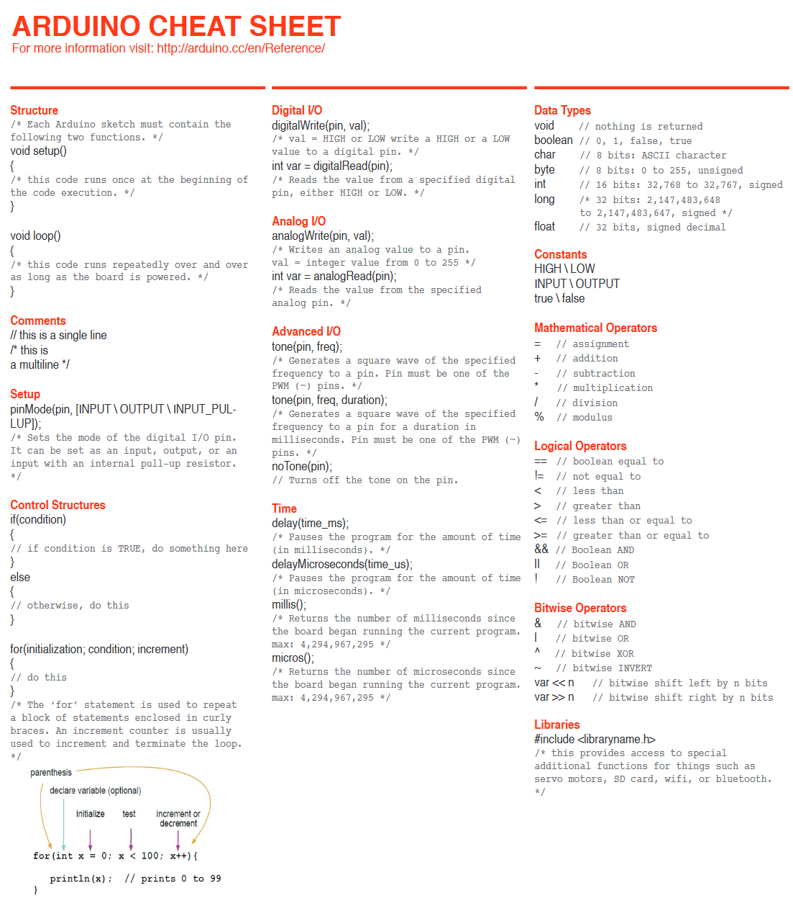

# Le code Arduino

## Documents de référence

* [Référence Arduino sur Arduino.cc](https://www.arduino.cc/reference/en/)
* [Arduino Programming Notebook de Bryan W Evans (2017) en version PDF](../pdf/arduino_programming_notebook-bryan_w_evans.pdf)

## Variables les plus communes

| Type | Taille | Description |
|---------|---------|---------|
| `int`    | 16 bits     |   pour stocker un chiffre général compris entre -32 768 et 32 767       |
| `unsigned long`    | 32 bits      |  pour stocker un chiffre (surtout du temps en millisecondes) compris entre 0 et 4 294 967 295  |
| `float`     | 32 bits      |  pour stocker des nombres décimaux       |

## D'autres variables assez communes

| Type | Taille | Description |
|---------|---------|---------|
| `char`     | 8 bits     |  pour stocker des caractères        |
| `byte `    | 8 bits     |   pour stocker un chiffre compris entre 0 et 255      |
| `unsigned int`     | 16 bits     |   pour stocker un chiffre compris entre 0 et 65 535        |
| `long`     | 32 bits     | pour stocker un chiffre compris entre  -2 147 483 648 et 2 147 483 647        |
| `double`     | 64 bits     |  pour stocker des nombres décimaux avec plus de précision       |


## Code minimal

```arduino

// VARIABLE GLOBALES

void setup() {
  // CODE À ROULER AU DÉMARRAGE

}

void loop() {
  // CODE À RÉPÉTER (LE PLUS RAPIDEMENT POSSIBLE)

}
```
On retrouve deux fonctions dans le code minimal : 
* `setup()`
* `loop()`

### setup()

La fonction setup() est appelée une seule fois lorsque le programme commence. C'est pourquoi c'est dans cette fonction que l'on va écrire le code qui n'a besoin d'être exécuté qu’une seule fois. C'est une  fonction d'initialisation. On y retrouvera la mise en place des différentes sorties et quelques autres réglages.

### loop()

Une fois que l'on a initialisé le programme, il faut ensuite créer le «cœur» du programme, autrement dit le programme en lui-même. C'est dans la fonction loop() que l’on va écrire le contenu du programme. Il faut savoir que cette fonction est appelée en permanence, c'est-à-dire qu'elle est exécutée une fois, puis lorsque son exécution est terminée, on l'exécute, encore et encore. On parle de boucle infinie!

## Déroulement du programme



Le programme se déroule de la façon suivante :
1. Prise en compte des instructions de l'en-tête déclarative.
2. Exécution au démarrage de la partie configuration définie par la fonction setup().
3. Exécution de la boucle qui s’exécute indéfiniment et le plus rapidement possible.

## Les instructions 


Les instructions sont des lignes de code qui disent au programme : « fais ceci, fais cela… » Ce sont donc les ordres qui seront exécutés par l'Arduino. Il est très important de respecter exactement la syntaxe ; faute de quoi, le code ne pourra pas être exécuté.

### Les points-virgules

Les points-virgules terminent les instructions. Si par exemple on dit dans notre programme : « appelle la fonction mangerLeChat », on doit mettre un point-virgule après l'appel de cette fonction.

Lorsque le code ne fonctionne pas, c'est souvent parce qu'il manque un point-virgule. Il faut donc être très attentif à ne pas les oublier !

### Les accolades { }

Les accolades sont les « conteneurs » du code du programme. Elles sont propres aux fonctions, aux conditions et aux boucles. Les instructions du programme sont écrites à l'intérieur de ces accolades.

### Les commentaires

Les commentaires sont des lignes de code qui seront ignorées par le programme. Elles ne servent à rien lors de l'exécution du programme. Ils permettent d'annoter et de commenter le programme.

Ligne unique de commentaire :
```arduino

// cette ligne est un commentaire sur UNE SEULE ligne
```

Ligne ou paragraphe sur plusieurs lignes :
```arduino
/* cette ligne est un commentaire, sur PLUSIEURS lignes
qui sera ignoré par le programme, mais pas par celui qui lit le code ;) */
```

### Les fonctions

Une fonction (également désignée sous le nom de procédure ou de sous-routine) est un bloc d'instructions que l'on peut appeler à tout endroit du programme.

Le langage Arduino est constitué d'un certain nombre de fonctions, par exemple analogRead(), digitalWrite() ou delay().

Il est possible de déclarer ses propres fonctions par exemple :
```arduino
void clignote(){
    digitalWrite (brocheLED,  HIGH) ;
    delay (1000) ;
    digitalWrite (brocheLED,  LOW) ;
    delay (1000) ;
}
```
Pour exécuter cette fonction, il suffit de taper la commande :
```arduino
clignote();
```
On peut faire intervenir un ou des paramètres dans une fonction :
```arduino
void clignote(int broche,int vitesse){
    digitalWrite (broche, HIGH) ;
    delay (1000/vitesse) ;
    digitalWrite (broche, LOW) ;
    delay (1000/vitesse) ;
}
```
Dans ce cas, l'on peut moduler leurs valeurs depuis la commande qui l'appelle :
```arduino
clignote(5,1000); //la sortie 5 clignotera vite
clignote(3,250); //la sortie 3 clignotera lentement
```
### Les structures de contrôle

Les structures de contrôle sont des blocs d'instructions qui s'exécutent en fonction du respect d'un certain nombre de conditions.

Il existe quatre types de structure :

`if...else` : exécute un code si certaines conditions sont remplies et éventuellement exécutera un autre code avec sinon.

Exemple :
```arduino
//si la valeur du capteur depasse le seuil
if(valeurCapteur>seuil){
    //appel de la fonction clignote
    clignote();
}
```
`while` : exécute un code tant que certaines conditions sont remplies.

Exemple :
```arduino
//tant que la valeur du capteur est supérieure à 250
while(valeurCapteur>250){
    //allume la sortie 5
    digitalWrite(5,HIGH);
    //envoi le message "0" au port serie
    Serial.println(1);
    //en boucle tant que valeurCapteur est supérieue à 250
}

Serial.println(0);

digitalWrite(5,LOW);
```
`for` : exécute un code pour un certain nombre de fois.

Exemple :
```arduino
//pour i de 0 à 255, par pas de 1
for (int i=0; i <= 255; i++){
    analogWrite(PWMpin, i);
    delay(10);
}
```
`switch...case` : fait un choix entre plusieurs codes parmi une liste de possibilités

Exemple :
```arduino
// fait un choix parmi plusieurs messages reçus
switch (message) {
    case 0: //si le message est "0"
        //allume que la sortie 3
        digitalWrite(3,HIGH);
        digitalWrite(4,LOW);
        digitalWrite(5,LOW);
        break;
    case 1: //si le message est "1"
        //allume que la sortie 4
        digitalWrite(3,HIGH);
        digitalWrite(4,LOW);
        digitalWrite(5,LOW);
        break;
    case 2: //si le message est "2"
        //allume que la sortie 5
        digitalWrite(3,LOW);
        digitalWrite(4,LOW);
        digitalWrite(5,HIGH);
        break;
    }
```


## «Arduino Cheat Sheet» de SparkFun



La version PDF du «Arduino Cheat Sheet» de SparkFun peut être téléchargée ici : [SparkFun Education - Classroom Downloads - Arduino Cheatsheet](https://sparkfuneducation.com/classroom-downloads/arduino-cheatsheet.html).

## Références

* FlossManuals. (s. d.). Programmer-Arduino. [https://fr.flossmanuals.net/arduino/programmer-arduino/](https://fr.flossmanuals.net/arduino/programmer-arduino/)

## Ressources additionnelles

* FlossManuals. (s. d.). Bien coder. [https://fr.flossmanuals.net/arduino/comment-bien-structurer-son-code/](https://fr.flossmanuals.net/arduino/comment-bien-structurer-son-code/)


## Sources des images

* Sparkfun. (s. d.). Arduino Cheatsheet. [https://sparkfuneducation.com/classroom-downloads/arduino-cheatsheet.html](https://sparkfuneducation.com/classroom-downloads/arduino-cheatsheet.html)
