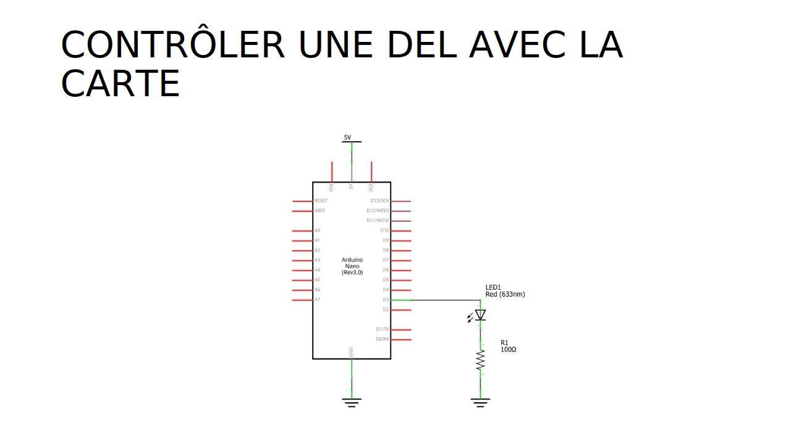

# Contrôler une DEL


## Segment de circuit


## Circuit complet



### Comparaison avec le circuit d'alimentation simple


## Fonctions pertinentes


## Fonction additionnelle


## Code complet 

```cpp
const int sortieNumeriqueDel = 3;

void setup() {
  pinMode(sortieNumeriqueDel, OUTPUT);
}

void loop() {
  digitalWrite(sortieNumeriqueDel, HIGH);  
  delay(1000);               
  digitalWrite(sortieNumeriqueDel, LOW);    
  delay(1000);              
}
```


