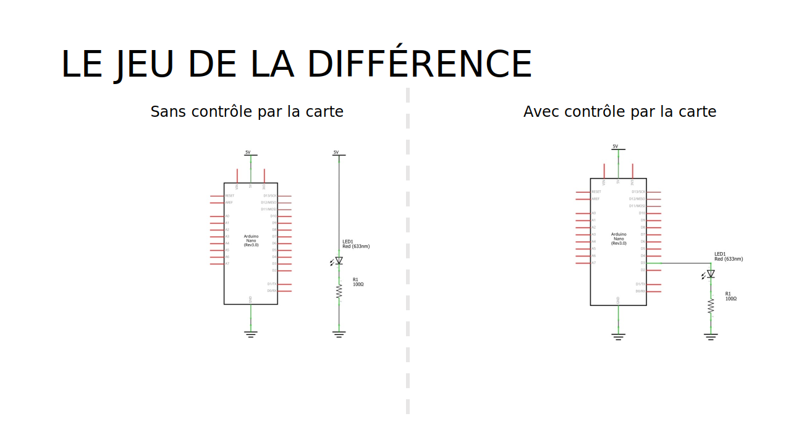

# Contrôler une DEL


## Segment de circuit


## Circuit complet
### Shéma du circuit


### Illustration du circuit


del_arduino

### Comparaison avec le circuit d'alimentation simple




## Fonctions pertinentes


## Fonction additionnelle


## Code complet 

```arduino
{{#include ./controle_del_arduino/controle_del_arduino.ino}}
```


