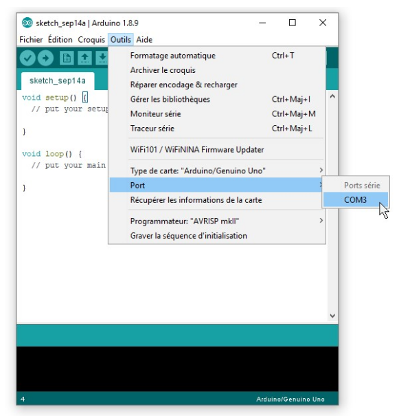

# Les cartes Arduino Nano

## Sous-modèles de cartes Arduino Nano

Il existe plusieurs sous-modèles de la carte Arduino Nano qui se différencient selon les options suivantes:
* **ATMEGA168** ou **ATMEGA328** : les termes ATMEGA168 et ATMEGA328 indiquent la taille de la mémoire de l'Arduino Nano. Toujours choisir le modèle avec l'identifiant **ATMEGA328**.
* **FTDI** ou **CH340** : les termes FTDI et CH340 indiquent le modèle de la puce qui assure la communication entre l'Arduino et l'ordinateur. Bien que les puces FTDI soient de meilleure qualité, les puces CH340 sont moins dispendieuses et performent adéquatement. Le choix entre ces deux options va surtout déterminer le pilote à installer (voir plus bas). 
* **Connecteur USB** : ici c'est un choix plus personnel, mais si possible, préférer le connecteur de type USB-C qui est plus solide.

## Broches des cartes Arduino Nano

 

## Installer le pilote de la carte Arduino Nano 

Si l'Arduino Nano utilise une puce CH340, les instructions suivantes pour installer le pilote doivent être suivies :
* BBOYHO et SANTAIMPERSONATOR. (s. d.). How to Install CH340 Drivers. Sparkfun. [https://learn.sparkfun.com/tutorials/how-to-install-ch340-drivers/all](https://learn.sparkfun.com/tutorials/how-to-install-ch340-drivers/all)

## Configuration du port

### Identifier le port de la carte Arduino Nano

### Configurer le logiciel Arduino pour la carte Arduino Nano

