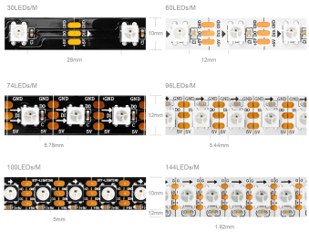
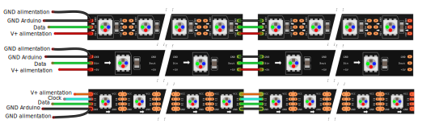

# Bande de DEL

## Préparation

## Modèles

Le modèle de bande de DEL que nous utilisons <!-- uniformiser nous ou on  -->est le WS281X (le X indique que le dernier chiffre n’est pas important). Elle fonctionne avec une tension d'alimentation à 12V.

Elle est aussi connue sous le nom de **NeoPixel**, parce qu’elle a été popularisé <!-- popularisée -->en Amérique par la compagnie Adafruit qui la baptisé <!-- l'a baptisée  -->ainsi. Adafruit fournit [plusieurs modèles de NeoPixel](https://www.adafruit.com/category/168). Cependant, les NeoPixels fonctionnent à 5V. Toutefois le système de contrôle est identique à celui de la bande de DEL que nous utilisons. <!-- virgule après toutefois et bande de DEL utilisée plutôt que nous utilisons  -->

## Ordre des couleurs des DEL

Pour chaque modèle de bande de DEL, les couleurs sont disposées dans un certain ordre: RGB, GRB, BGR, etc. **Dans notre cas, l'ordre est : RGB**

## Broches

Les NeoPixels possèdent au moins 3 broches qui doivent toutes être connectées :
* GND
* Alimentation (5V, 12V ou 24V selon les modèles)
* Entrée de données (*Data In*)

Les WS281X 12V possèdent 4 broches (la broche supplémentaire est optionnelle) :
* **GND**
* **+12V** pour l'alimentation
* **DI** pour l'entrée de données
* **BI** qui est optionnel et utilisé seulement en cas de bris d'un segment

## Branchement

### Bonnes pratiques

Adafruit recommande les bonnes pratiques de connexion suivantes : [Best Practices | Adafruit NeoPixel Überguide | Adafruit Learning System](https://learn.adafruit.com/adafruit-neopixel-uberguide/best-practices)

## Bibliothèques

**Les bibliothèques de DEL supportent souvent plusieurs modèles. Assurez-vous que vous sélectionnez le bon modèle dans le code!** <!-- uniformiser la façon de s'adresser au lecteur  -->

Les deux bibliothèques les plus populaires sont:
* [Adafruit NeoPixel](https://learn.adafruit.com/adafruit-neopixel-uberguide/the-magic-of-neopixels) : NeoPixel est plus simple à utiliser mais moins performante.
* [FastLED](https://github.com/FastLED/FastLED) : FastLED est plus performante, mais plus compliquée à utiliser. Cette bibliothèque présente aussi les meilleurs exemples.

## Bibliothèque FastLED

Exemples intéressants à essayer:
* Cylon
* TwinkleFox
* Fire2021
* DemoReel100

Dans **chaque** exemple, vous devez vous assurer que la configuration est adéquate : <!-- uniformiser la façon de s'adresser au lecteur  -->
* Que le DATA_PIN ou LED_PIN corresponde à la broche Arduino qui est connectée à la broche DI de la bande. 
* Que NUM_LEDS corresponde au nombre de DEL de votre bande <!-- uniformiser si un point à la fin ou non  -->
* Que COLOR_ORDER corresponde à l’ordre des couleurs RGB

