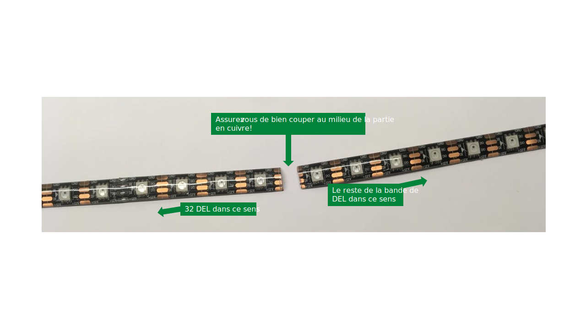
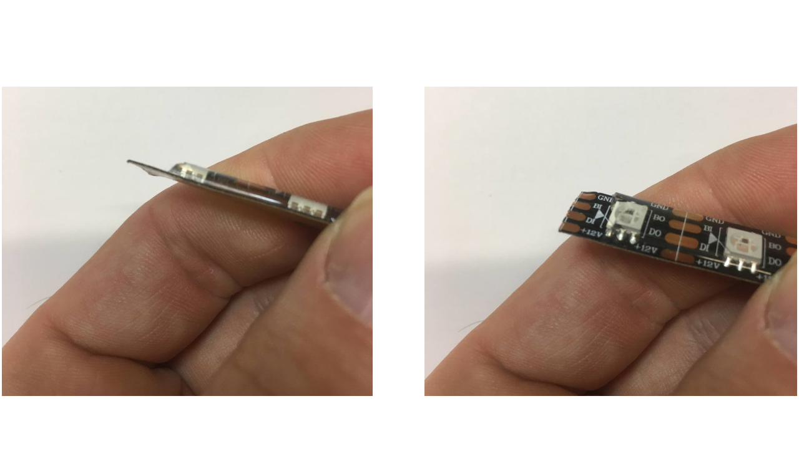
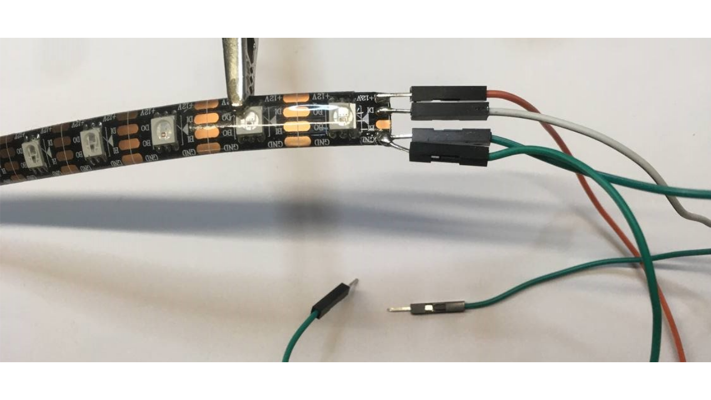

# Bande de DEL

## Préparation

## Branchement

## Bibliothèques

Le modèle de bande de DEL que nous utilisons est le WS281X (le X indique que le dernier chiffre n’est pas important). Elle fonctionne avec une tension d'alimentation à 12V.

Elle est aussi connue sous le nom de **NeoPixel**, parce qu’elle a été popularisé en Amérique par la compagnie Adafruit qui la baptisé ainsi. Adafruit fournit [plusieurs modèles de NeoPixel](https://www.adafruit.com/category/168). Cependant, les NeoPixels fonctionnent à 5V. Toutefois le système de contrôle est identique à notre bande de DEL.

Les WS281X possèdent trois broches :
* GND
* POWER (5V, 12V ou 24V selon les modèles)
* DATA

Aussi, les DEL de couleur sont disposées dans un certain ordre: RGB, GRB, BGR, etc. Dans notre cas, le **COLOR_ORDER** est RGB.

**Les bibliothèques de DEL supportent souvent plusieurs modèles. Assurez-vous que vous sélectionnez le bon modèle dans le code!**

Les deux bibliothèques les plus populaires sont:
* [Adafruit NeoPixel](https://learn.adafruit.com/adafruit-neopixel-uberguide/the-magic-of-neopixels) : NeoPixel est plus simple à utiliser mais moins performante.
* [FastLED](https://github.com/FastLED/FastLED) : FastLED est plus performante, mais plus compliquée à utiliser. Cette bibliothèque présente aussi les meilleurs exemples.

## Bibliothèque FastLED

Exemples intéressants à essayer:
* Cylon
* TwinkleFox
* Fire2021
* DemoReel100

Dans **chaque** exemple, vous devez vous assurer que la configuration est adéquate :
* Que le DATA_PIN ou LED_PIN corresponde à la broche Arduino qui est connectée à la broche DI de la bande.
* Que NUM_LEDS corresponde au nombre de DEL de votre bande
* Que COLOR_ORDER corresponde à l’ordre des couleurs RGB

