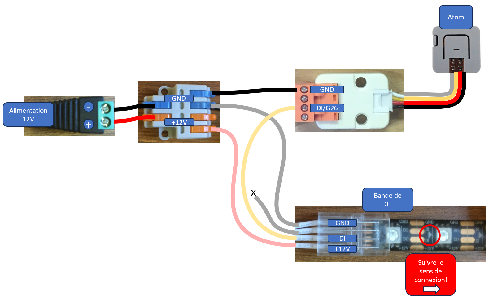
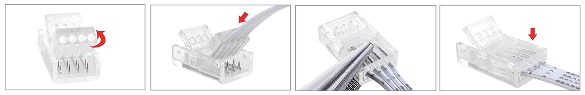
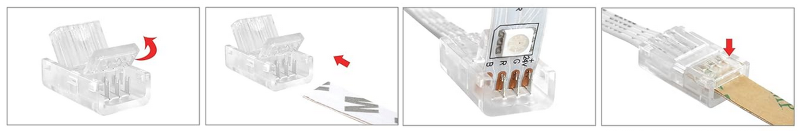
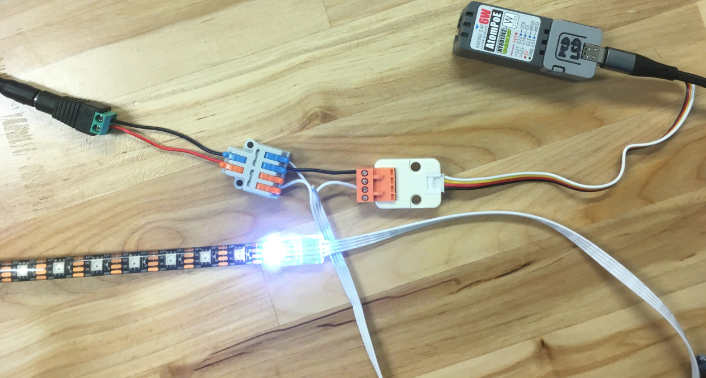

# Contrôler une bande de DEL avec un M5Stack Atom

## Introduction

Le modèle de bande de DEL utilisé ici est le WS281X (le X indique que le dernier chiffre n’est pas important). Elle fonctionne avec une tension d'alimentation à 12V.

De façon générale, elle est aussi connue sous le nom de **NeoPixel**. Elle a été popularisée et baptisée en Amérique par la compagnie Adafruit. Adafruit fournit [plusieurs modèles de NeoPixel](https://www.adafruit.com/category/168). Cependant, les NeoPixels d'Adafruit fonctionnent à 5 Volts. Toutefois, leur système de contrôle est identique à celui de la bande de DEL utilisées ici. 


## Ordre des couleurs des DEL

Pour chaque modèle de bande de DEL, les couleurs sont disposées dans un certain ordre: RGB, GRB, BGR, etc. **Dans notre cas, l'ordre est : RGB**.

## Broches

Les NeoPixels possèdent au moins 3 broches qui doivent toutes être connectées :
* GND.
* Alimentation (5V, 12V ou 24V selon les modèles).
* Entrée de données (*Data In*).

Les WS281X 12V possèdent 4 broches (la broche supplémentaire est optionnelle) :
* **GND**.
* **+12V** pour l'alimentation.
* **DI** pour l'entrée de données.
* **BI** dont l'utilisation est optionnelle et utilisée seulement en cas de bris d'un segment.

## Branchement












### Bonnes pratiques

Adafruit recommande les bonnes pratiques de connexion suivantes : [Best Practices | Adafruit NeoPixel Überguide | Adafruit Learning System](https://learn.adafruit.com/adafruit-neopixel-uberguide/best-practices).

## Bibliothèque FastLED

**Les bibliothèques de bandes de DEL supportent souvent plusieurs modèles. On doit sélectionner le bon modèle dans le code!**  Il est recommandé d'utiliser la bibliothèque [FastLED](https://github.com/FastLED/FastLED) qui peut être installée à partir du gestionnaire de bibliothèques. FastLED est trèes performante, mais un êu compliquée à utiliser. 

### À ajouter à l'espace global

```arduino
#define NOMBRE_PIXELS 30 
CRGB mesPixels[NOMBRE_PIXELS];
```

### À ajouter dans setup()

Il faut ajouter les pixels à FastLED. Le 26 c'est le numéro de la broche du Atom qui envoie les données à la bande de pixels.

```arduino
FastLED.addLeds<WS2812, 26, RGB>(mesPixels, NOMBRE_PIXELS);
```

### Dans loop()

Pour changer la couleur d'un pixel, changer sa couleur CRGB dans le tableau. Par exemple, pour changer la couleur du pixel à l'index 13 :
```arduino
int indexDuPixel = 13;
int rouge = 255;
int vert = 255;
int bleu = 255;
mesPixels[indexDuPixel] = CRGB( rouge , vert, bleu);
```
Par après, mettre à jour les pixels de la bande de DEL :
```arduino
FastLED.show();
```

### Exemple de code FastLED avec des animations

```arduino
{{#include ./bande-del_atom_animations/bande-del_atom_animations.ino}}
```

