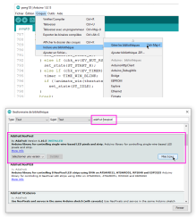
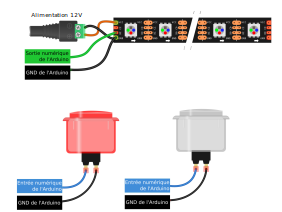
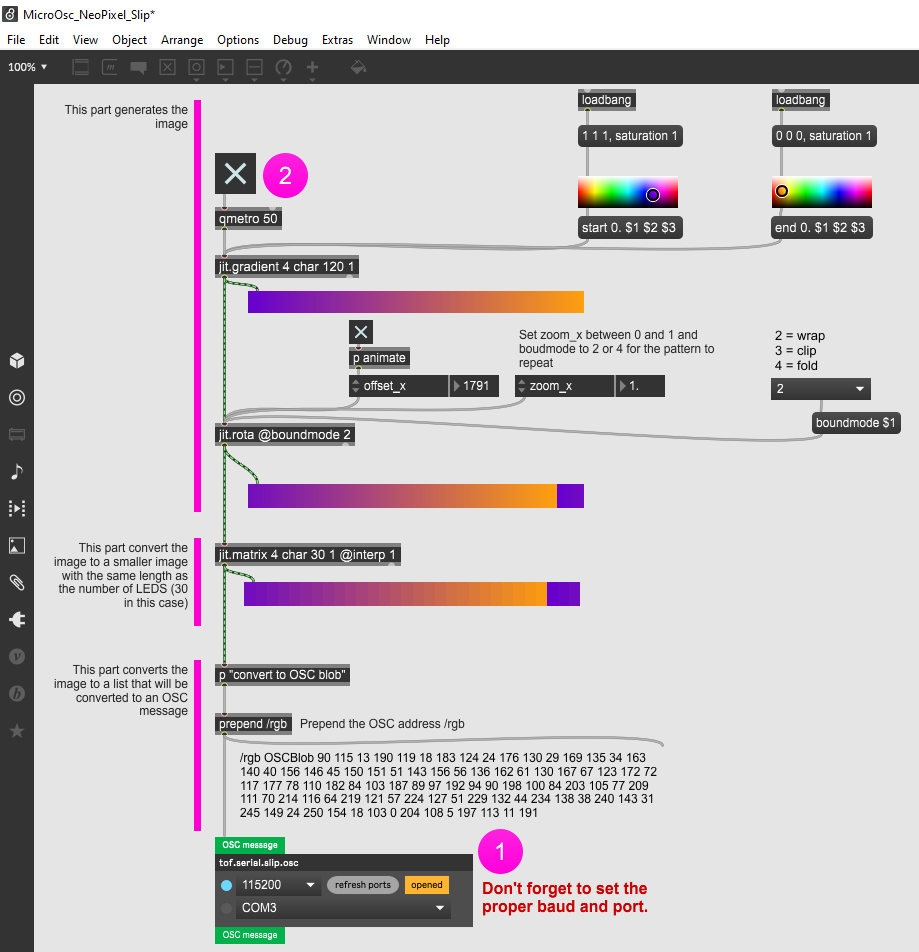
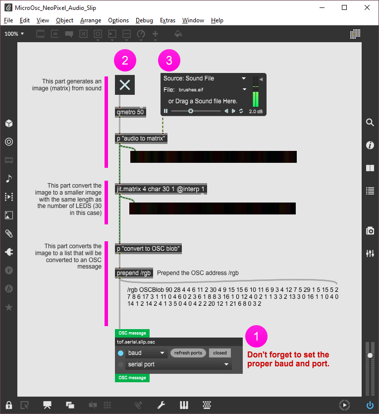

# Contrôler une bande de DEL avec l'Arduino Nano

## Préparation


## Modèles

Le modèle de bande de DEL qu'on utilise est le WS281X (le X indique que le dernier chiffre n’est pas important). Elle fonctionne avec une tension d'alimentation à 12V.

Elle est aussi connue sous le nom de **NeoPixel**, parce qu’elle a été popularisée en Amérique par la compagnie Adafruit qui l'a baptisé ainsi. Adafruit fournit [plusieurs modèles de NeoPixel](https://www.adafruit.com/category/168). Cependant, les NeoPixels fonctionnent à 5V. Toutefois, le système de contrôle est identique à celui de la bande de DEL qu'on utilise. 


## Ordre des couleurs des DEL

Pour chaque modèle de bande de DEL, les couleurs sont disposées dans un certain ordre: RGB, GRB, BGR, etc. **Dans notre cas, l'ordre est : RGB**.

## Broches

Les NeoPixels possèdent au moins 3 broches qui doivent toutes être connectées :
* GND.
* Alimentation (5V, 12V ou 24V selon les modèles).
* Entrée de données (*Data In*).

Les WS281X 12V possèdent 4 broches (la broche supplémentaire est optionnelle) :
* **GND**.
* **+12V** pour l'alimentation.
* **DI** pour l'entrée de données.
* **BI** qui est optionnel et utilisé seulement en cas de bris d'un segment.

## Branchement


### Bonnes pratiques

Adafruit recommande les bonnes pratiques de connexion suivantes : [Best Practices | Adafruit NeoPixel Überguide | Adafruit Learning System](https://learn.adafruit.com/adafruit-neopixel-uberguide/best-practices).

## Bibliothèques

**Les bibliothèques de DEL supportent souvent plusieurs modèles. On doit sélectionner le bon modèle dans le code!** 

Les deux bibliothèques les plus populaires sont:
* [Adafruit NeoPixel](https://learn.adafruit.com/adafruit-neopixel-uberguide/the-magic-of-neopixels) : NeoPixel est plus simple à utiliser mais moins performante.
* [FastLED](https://github.com/FastLED/FastLED) : FastLED est plus performante, mais plus compliquée à utiliser. Cette bibliothèque présente aussi les meilleurs exemples.

### Bibliothèque Adafruit NeoPixel



### Bibliothèque FastLED


Exemples intéressants à essayer:
* Cylon.
* TwinkleFox.
* Fire2021.
* DemoReel100.

Dans **chaque** exemple, on doit s'assurer que la configuration est adéquate : 
* Que le DATA_PIN ou LED_PIN corresponde à la broche Arduino qui est connectée à la broche DI de la bande.
* Que NUM_LEDS corresponde au nombre de DEL de la bande.
* Que COLOR_ORDER corresponde à l’ordre des couleurs RGB.


## Pong 1D (Pong à une dimension)

### Qu'est-ce que le Pong original?

* [Data Driven Gamer: Pong (Atari, 1972 arcade, 60fps) - YouTube](https://www.youtube.com/watch?v=CKzWAxMfZRA)
* [Atari Pong Table Electromechanical Game Debut @ IAAPA 2017 (Calinfer / UNIS) - YouTube](https://www.youtube.com/watch?v=84Ymt9BAq5s)
* [Let's Play - The PainStation - YouTube](https://www.youtube.com/watch?v=6bm7fLcj5UI)

### Recréer Pong en 1D

Cet exemple est basé sur le projet [DIY Arduino 1D Pong Game with WS2812 LED Strip](https://create.arduino.cc/projecthub/mircemk/diy-arduino-1d-pong-game-with-ws2812-led-strip-a2418b). 

Le code original a été écrit par B.Stultiens en 2015. La version présentée ici a été modifiée pour en régler des bogues, pour le mettre à jour et pour en retirer toute la partie audio. Une simulation du projet modifié peut être consultée en ligne ici : [https://pi-pico.preview.wokwi.com/arduino/projects/345886566467502674](https://pi-pico.preview.wokwi.com/arduino/projects/345886566467502674)

Le projet dépend de la bibliothèque **Adafruit NeoPixel** et nécessite:
* 1 bande de DEL d'au moins 32 pixels
* la bibliothèque NeoPixel pour contrôler la bande de DEL
* 2 interrupteurs pour démarrer et frapper la balle
* *Optionnel*: 2 autres interrupteurs qui peuvent être ajoutés pour permettre l'activation des bonus de jeu

### Le circuit



### Le code

Ne pas oublier de modifier la configuration matérielle pour qu'elle corresponde au circuit: 
* **PIN_WSDATA**: Le numéro de la broche Arduino reliée à la broche DI de la bande de DEL
* **NPIXELS**: Le nombre de pixels dans botre bande de DEL
* **PIN_BUT_RS**: Le numéro de la broche Arduino reliée au bouton de droite
* **PIN_BUT_LS**: Le numéro de la broche Arduino reliée au bouton de gauche
* **ZONE_SIZE**: La taille des buts
* **TIME_SPEED_MIN**: La vitesse de la balle

Télécharger le code ici : [pong-1D_arduino.ino](./pong-1D_nano/pong-1D_nano.ino)

## Contrôler une bande de DEL par OSC

### Préalables

* Alimentation d'une bande de DEL (30 pixels) avec la broche *Data Input(DI)* branchée à la broche 4 de l'Arduino; voir la section [Bande de DEL](../bande_del/bande_del.md).
* Installation de la bibliothèque de contrôle de DEL : Adafruit NeoPixel.
* Installation de la bibliothèque de communication : MicroOsc.

### Code Arduino Nano 

```Arduino
// MicroOsc_NeoPixel_SLIP
// by Thomas O Fredericks
// 2022-11-09

// HARDWARE REQUIREMENTS
// ==================
// NeoPixel LED strip connected to pin 4

// REQUIRED LIBRARIES
// ==================
// MicroOsc
// Adafruit NeoPixel

// REQUIRED CONFIGURATION
// ======================
// Set Serial baud to 115200


#include <MicroOscSlip.h>
// The number 128 between the < > below  is the maximum number of bytes reserved for incomming messages.
// If you want to control 30 RGB NeoPixels, you need at least 90 bytes for the data (1 byte per color). We are reserving a little more (128 bytes) just in case.
// Outgoing messages are written directly to the output and do not need more reserved bytes.
MicroOscSlip<128> myMicroOsc(&Serial);

#include <Adafruit_NeoPixel.h>  
const int myPixelCount = 30;
const int myPixelPin = 4;
Adafruit_NeoPixel myPixelStrip(myPixelCount, myPixelPin , NEO_RGB + NEO_KHZ800);

void setup() {
  // INITIATE SERIAL COMMUNICATION
  Serial.begin(115200);                                         
  // INITIALIZE PIXEL STRIP
  myPixelStrip.begin(); 
  // STARTUP ANIMATION
  // LIGHT ALL PIXELS IN WHITE THEN TURN THEM ALL OFF
  for ( int i=0; i < myPixelCount; i++ ) {
     myPixelStrip.setPixelColor(i, myPixelStrip.Color(255, 255 , 255));  
     myPixelStrip.show();
     delay(100);                                       
  }
  delay(1000);
  myPixelStrip.clear();
  myPixelStrip.show();
}

// FUNCTION THAT IS CALLED FOR EVERY RECEIVED OSC MESSAGE
void myOnReceiveMessage( MicroOscMessage& receivedOscMessage ) {
  // IF THE ADDRESS IS /rgb
  if ( receivedOscMessage.fullMatch("/rgb") ) {   
                 
    // CREATE A VARIABLE TO STORE THE POINTER TO THE DATA
    const uint8_t* blobData;                                    
    // GET THE DATA SIZE AND THE POINTER TO THE DATA
    int blobSize = receivedOscMessage.nextAsBlob(&blobData);    
    // IF DATA SIZE IS LARGER THAN 0 AND IS A MULTIPLE OF 3 AS REQUIRED BY RGB PIXELS
    if ( blobSize > 0 && blobSize % 3 == 0 ) {                  
      // DIVIDE THE DATA BY 3 TO GET THE NUMBER OF PIXELS
      int blobPixelCount = blobSize / 3;                        
      // ITERATE THROUGH EACH PIXEL IN THE BLOB 
      for ( int i = 0 ; i < blobPixelCount ; i++ ) {            
        // EACH PIXEL HAS 3 BYTES, SO WE GO THROUGH THE DATA, 3 AT A TIME
        int blobIndex = i * 3; 
        uint8_t red =  myPixelStrip.gamma8(blobData[blobIndex]);
        uint8_t green =  myPixelStrip.gamma8(blobData[blobIndex+1]); 
        uint8_t blue =  myPixelStrip.gamma8(blobData[blobIndex+2]);                            
        myPixelStrip.setPixelColor(i, myPixelStrip.Color(red , green , blue));
      }
      myPixelStrip.show();
    }
  }
}

void loop() {
  myMicroOsc.receiveMessages( myOnReceiveMessage );
}
```

### Contrôle d'animation de la bande de DEL

#### À partir d'une image (matrice) générative dans Max

[](./MicroOsc_NeoPixel_Slip.maxpat)

#### À partir de la conversion brute du signal audio dans Max

[](./MicroOsc_NeoPixel_Audio_Slip.maxpat)