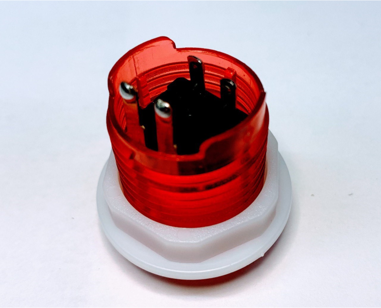
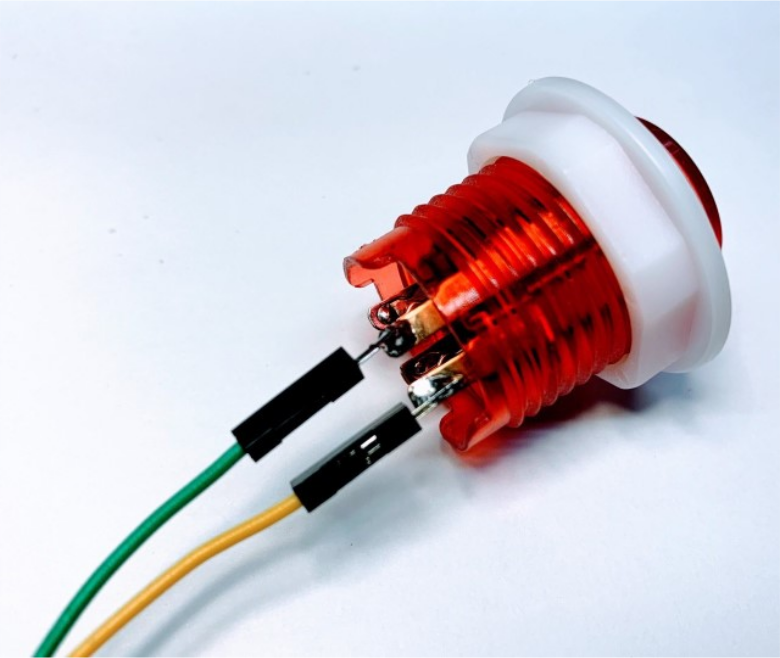
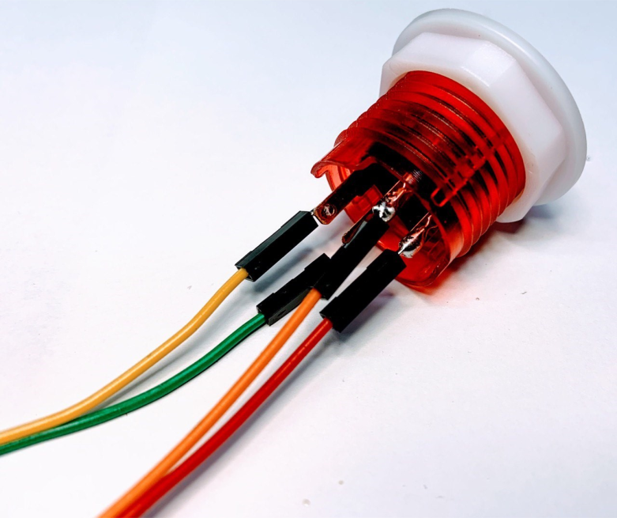
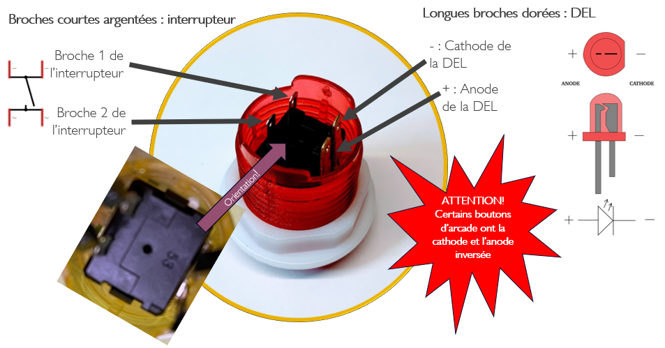
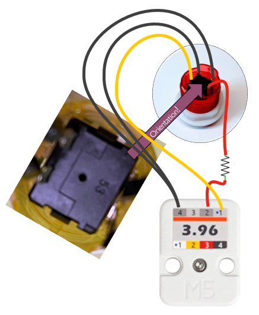

# Bouton d'arcade

## Le bouton d'arcade 5V SANS résistance

### Référence du produit

* [50 PCS 28mm / 24mm 5V LED Illuminated Light Push Button With Mirco Swich Nut Round Body For DIY Arcade Raspberry Pi sur Aliexpress](https://www.aliexpress.us/item/2255800032195150.html)

### Microsoudure du bouton d'arcade 5V SANS résistance

