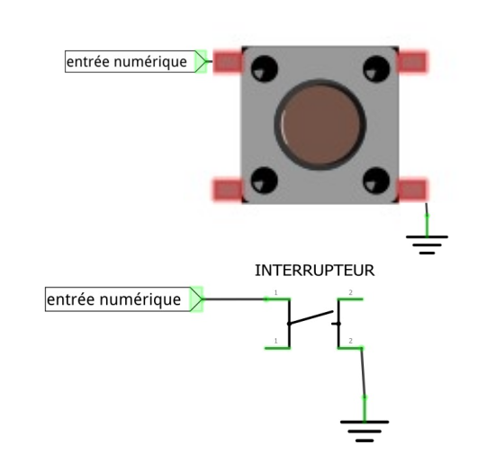
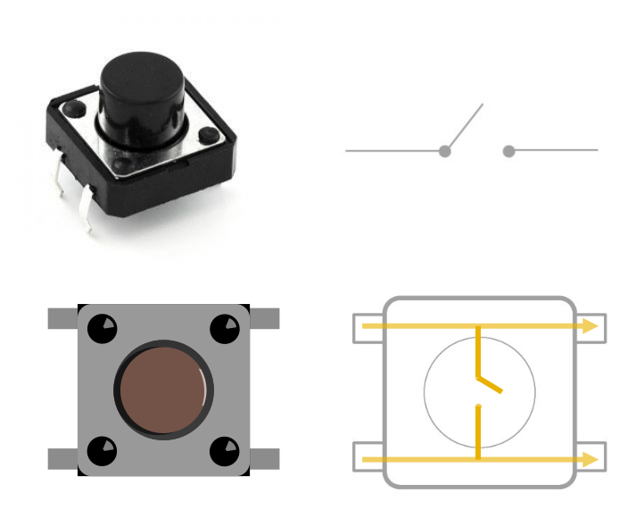
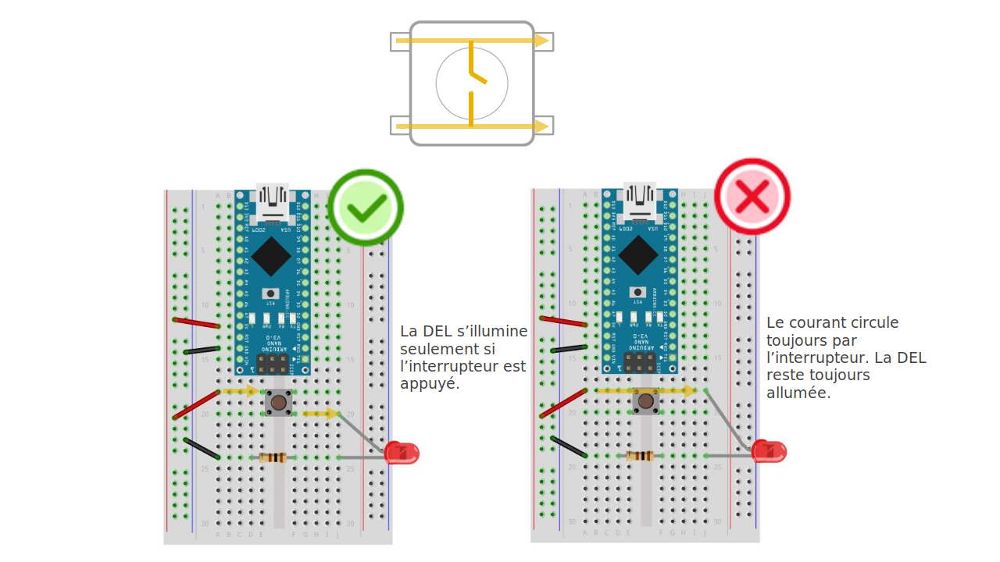
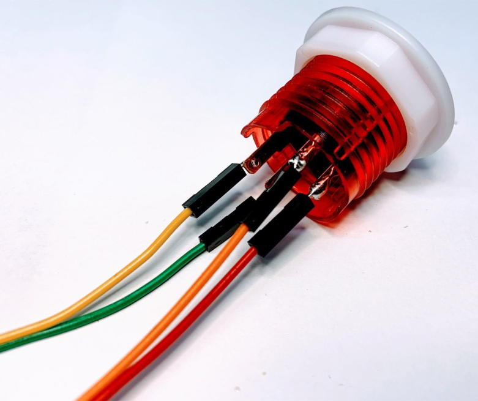
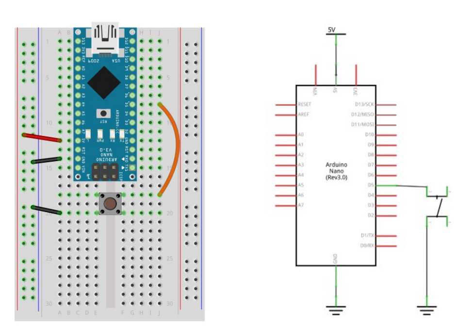
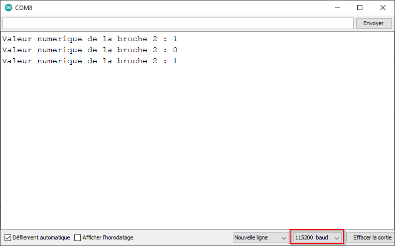

# Bouton simple 

## Un bouton est avant tout un interrupteur de courant



## Qu'est-ce qu'une entrée numérique

Une entrée numérique est une broche ou un module qui retourne uniquemenent deux valeurs possibles en fonction d'un état physique externe mesuré.

En fonction du signal reçu, le microcontrôleur pourra effectuer une tâche prévue (allumer la lumière lorsqu'un capteur de mouvement détecte une présence, par exemple). 

Si une broche est configurée en entrée (`INPUT`), nous pouvons effectuer la mesure numérique de la tension électrique. Cette mesure s’effectue sur une échelle à deux niveaux : 
* haute tension : `HIGH` présence d’une tension plus grande que 3.5V.
* basse tension : `LOW` présence d’une tension sous 1.5V.

Si un bouton simple est relié à un circuit de résistance de rappel relié à une broche configurée en entrée(`INPUT_PULLUP`) nous pouvons effectuer la mesure numérique de la tension électrique qui change selon que le bouton est appuyé ou pas : 
* haute tension  (`HIGH`) le bouton est relaché.
* basse tension (`LOW`) le bouton est appuyé.


## Le bouton poussoir





## Le bouton d'arcade

### Référence du produit

* Adafruit. (s. d.). Arcade Button with LED – 30mm Translucent Red. [https://www.adafruit.com/product/3489](https://www.adafruit.com/product/3489)

### Microsoudure du bouton d'arcade





## Branchement avec la résistance de rappel interne 

Il existe plusieurs façon de brancher un interrupteur à un microcontrôleur. Le circuit avec une résistance de rappel interne est utilisée dans le schéma ci-bas. Dans le code, il faut activer le mode correspondant à la résistance internet avec la fonction `pinMode()` ainsi :
```arduino
pinMode( maBroche , INPUT_PULLUP);
```
Lorsque l'interrupteur n’est pas appuyé, il y a présence de 5V (HIGH) à la broche 5 : la résistance de rappel interne est branchée au 5V et maintient l’entrée à ce niveau par défaut.

Lorsque l'interrupteur est appuyé, il y a présence de 0V (LOW) à la broche 5 : la broche 5 est directement relié au GND (0V).



## Code général pour un bouton simple


Pour effectuer la mesure numérique de la tension électrique présente à une broche, nous utilisons la paire de fonctions suivantes :
1) Configurer la broche `numeroBoche` en mode entrée avec `INPUT_PULLUP` :
```cpp
pinMode( numeroBoche , INPUT_PULLUP );
```
2) Effectuer la mesure de la tension à la broche `numeroBoche` et sauvegarder la valeur dans une variable :
```cpp
int mesureDeTension;
mesureDeTension = digitalRead( numeroBoche );
```
## Debogage d'une entrée numérique

Dans le code suivant, nous déboguons l'entrée numérique 2 : 
```arduino
int maBrocheEntreeNumerique = 2;
int maValeurPrecedente; // VALEUR PRÉCÉDENTE DE L'ENTRÉE NUMERIQUE

unsigned long monChronoDepart = 0; // DEPART DE MON CHRONOMÈTRE

void setup() { // AU DÉMARRAGE
  Serial.begin(115200); // CONFIGURER LA COMMUNICATION SÉRIE
  pinMode( maBrocheEntreeNumerique , INPUT_PULLUP); // CONFIGURER LA BROCHE DE L'ENTRÉE NUMERIQUE EN ENTRÉE
}

void loop() { // RÉPÉTER LE PLUS VITE POSSIBLE

  unsigned long monChronoEcoule = millis() - monChronoDepart; // TEMPS ÉCOULÉ DE MON CHRONOMÈTRE
  unsigned long monChronoIntervalle = 20; // INTERVALLE DE TEMPS EN MILLISECONDES

  if ( monChronoEcoule >= monChronoIntervalle ) { // SI 20 MS SE SONT ECOULEES...
     monChronoDepart = millis(); // ...REDÉMARRER LE CHRONOMÈTRE...
     
    int maNouvelleValeur = digitalRead( maBrocheEntreeNumerique ); // LECTURE DE TENSION
    
    if ( maNouvelleValeur != maValeurPrecedente ) { // SI LA NOUVELLE VALEUR EST DIFFERENTE DE LA PRÉCÉDENTE
      Serial.print( "Valeur numerique de la broche " ); // ENVOYER UNE EN-TÊTE DE MESSAGE
      Serial.print( maBrocheEntreeNumerique ); // ENVOYER LE NUMÉRO DE LA BROCHE
      Serial.print( " : " ); // ENVOYER UN SÉPARATEUR ENTRE LE NUMÉRO DE LA BROCHE ET SA VALEUR
      Serial.print( maNouvelleValeur ); // ENVOYER LA VALEUR
      Serial.println();  // TERMINER LE MESSAGE
    }
    
    maValeurPrecedente = maNouvelleValeur; // METTRE EN MÉMOIRE LA NOUVELLE VALEUR

  }
}
```



## Allumer ou éteindre une DEL à partir d'un interrupteur
```arduino
int brocheDel = 3;
int brocheInterrupteur = 12;

void setup() {
  // put your setup code here, to run once:
  pinMode( brocheDel , OUTPUT);
  pinMode( brocheInterrupteur , INPUT_PULLUP);
}

void loop() {
  // put your main code here, to run repeatedly:
  int mesureDeTension = digitalRead( brocheInterrupteur); 
  if ( mesureDeTension == LOW ) {
    digitalWrite( brocheDel, HIGH);
  } else {
    digitalWrite( brocheDel, LOW);
  }
}
```

## Contrôler le clignotement d'une DEL à partir d'un interrupteur
```arduino
int brocheDel = 3;
int brocheInterrupteur = 12;

void setup() {
  // put your setup code here, to run once:
  pinMode( brocheDel , OUTPUT);
  pinMode( brocheInterrupteur , INPUT_PULLUP);
}

void loop() {
  // put your main code here, to run repeatedly:
  int mesureDeTension = digitalRead( brocheInterrupteur); 
  if ( mesureDeTension == LOW ) {
    digitalWrite( brocheDel, HIGH);
    delay(250);
    digitalWrite( brocheDel, LOW);
    delay(250);
  } else {
    digitalWrite( brocheDel, LOW);
  }
}
```
