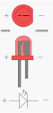

# Diode électroluminescente (DEL)

La diode électroluminescente (DEL) est un *actionneur* qui transforme un signal électrique en lumière. Elle est appelée «LED» en anglais. 

En utilisant divers matériaux semi-conducteurs, on fait varier la couleur de la lumière émise par la DEL. Il existe enfin une grande variété de formes de DEL.

Le courant électrique ne peut traverser la diode que dans le sens de l’anode vers la cathode.

La DEL a deux pôles
* Anode : pôle positif
* Cathode : pôle négatif

## Limiter l'intensité du courant

**Attention**: il faut limiter l'intensité du courant qui traverse la DEL. 

Pour une DEL rouge standard:
* La DEL crée une chute de tension (*voltage drop*) d’environ 2.1 Volts.
* L'intensité qui traverse la DEL doit être d'environ 0.02 Ampères (20 mA). 
* L’utilisation d’une résistance est obligatoire pour réduire l'intensité et ne pas griller la DEL.

