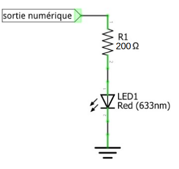
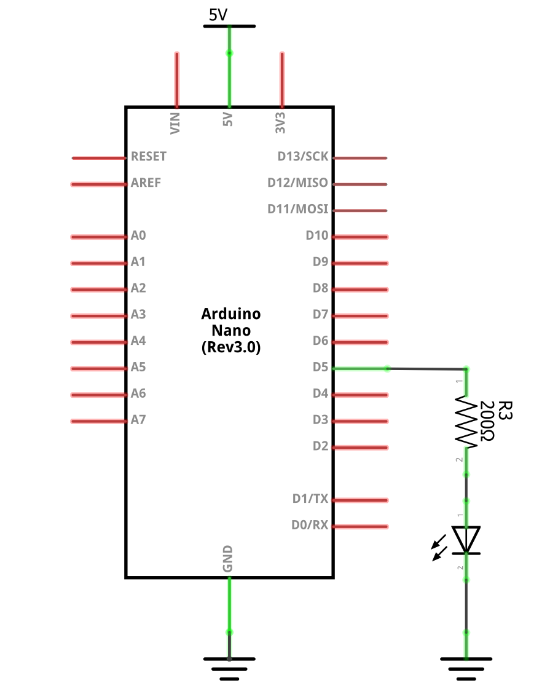
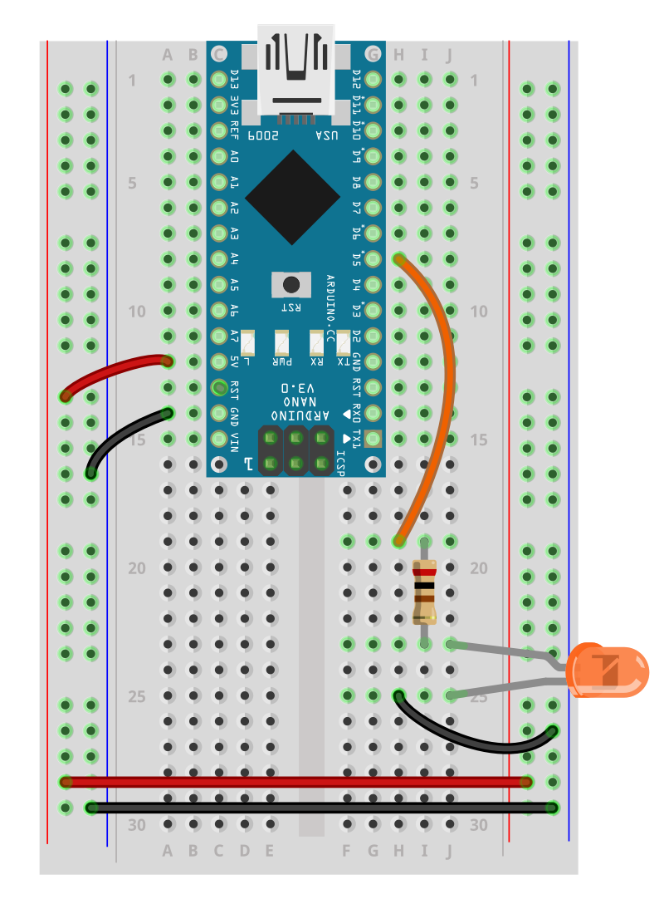
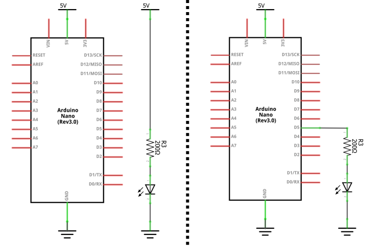
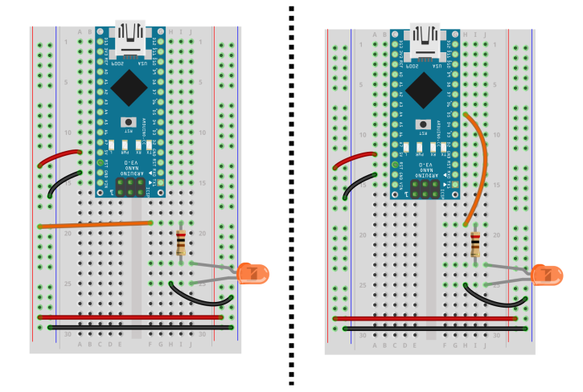
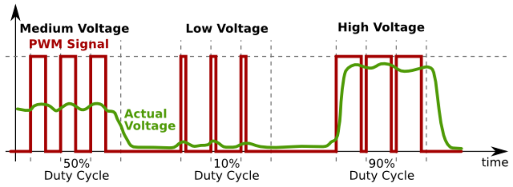
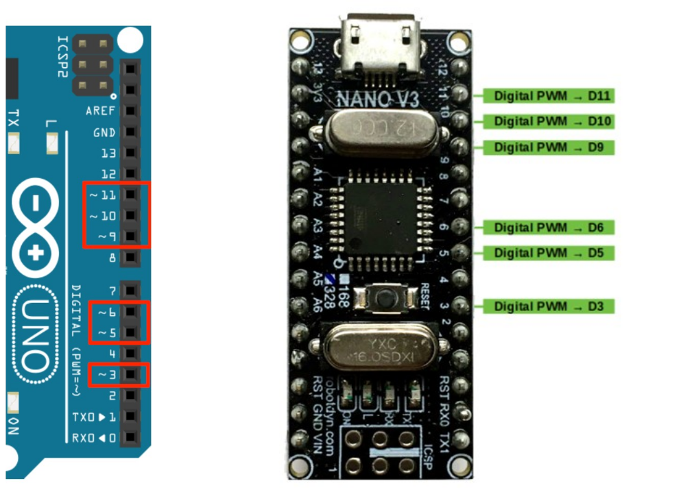

# Contrôler une DEL

## Sortie numérique

Une DEL peut être contrôlée par une sortie numérique. Une sortie numérique permet régler la tension présente à la plupart des broches de la carte Arduino. 

Cette tension peut être réglée à deux niveaux :
* `HIGH` : règle la tension de sortie à 5V (pôle positif)
* `LOW` : règle la tension de sortie à 0V (pôle négatif/GND)

Pour régler la tension électrique de sortie d'une broche, on utilise ces blocs de code :
1) Configurer la broche `numeroBoche` en mode sortie avec `OUTPUT` :
```arduino
pinMode( numeroBoche , OUTPUT );
```

2) Pour règler la tension de sortie à 5V (pôle positif) :
```cpp
digitalWrite( numeroBoche, HIGH );
```

3) Pour règler la tension de sortie à 0V (pôle négatif/GND) :
```cpp
digitalWrite( numeroBoche, LOW );
```

## Circuit

### Segment de circuit

Voici un segment de circuit qui permet de connecter la DEL à l'Arduino :




### Schéma du circuit

Voici le même segment de circuit mais placé dans le un schéma plus complet :



### Illustration du circuit

Voici l'illustration du schéma précédent :


del_arduino

### Comparaison avec le circuit d'alimentation simple

Dans les images suivantes, nous présentons une comparaison entre l'alimentation directe sans contrôle de la DEL avec le contrôle par Arduino.






## Code pour faire clignoter la DEL 

```arduino
{{#include ./controle_del_arduino/controle_del_arduino.ino}}
```


## Sortie «analogique»/modulation de largeur d'impulsion (PWM)

Un sortie «analogique» permet de **simuler** une variation de tension électrique. Par exemple, un sortie analogique peut être utilisée pour faire varier la luminosité d'une DEL et effectuer des effets de fondu.

Pour **simuler** cette variation de tension, nous utilisons la modulation de largeur d'impulsion, *Pulse Width Modulation (PWM)* en anglais. Il s'agit de faire alterner à grande fréquence les périodes hautes (allumée) et basses (éteinte) de la broche.  En d'autre termes, cela signifie que la DEL clignote très très vite. Tellement vite que l'oeil ne percevra qu'une lumière continue qui varie d'intensité. 



Pour utiliser une sortie analogique, on utilise cette paire de blocs de code :
1) Configurer la broche `maBroche` en mode sortie avec `OUTPUT` :
```arduino
pinMode( maBroche , OUTPUT );
```
2) Contrôler la modulation de largeur d'impulsion, qui est entre 0 et 255, de la broche `maBroche` avec `analogWrite()` :
```arduino
int maValeurPWM = 255; // VALEUR ENTRE 0 et 255
analogWrite( maBroche, maValeurPWM );
```

### Information complémentaire sur les sorties analogiques/la modulation de largeur d’impulsion (PWM)

* JORDANDEE. (s. d.). Pulse Width Modulation. Sparkfun. [https://learn.sparkfun.com/tutorials/pulse-width-modulation](https://learn.sparkfun.com/tutorials/pulse-width-modulation)


## Broches PWM
Les broches capables de supporter modulation de largeur d'impulsions sont identifiées par un «~» ou le mot «PWM». Il s'agit des broches 3, 5, 6, 9, 10 et 11 pour l'Arduino Nano.



## Code pour simuler une chandelle

Dans cet exemple, nous simulons une chandelle en faisant varier aléatoirement l'intensité d'une DEL. 

### Aléatoire

La fonction `random()` permet de générer un entier `int` entre un minimum et un maximum. Il est très important de remarquer que  la valeur maximale est exclue des valeurs possibles; si le miminum est 0 et le maximum est 5, les valeurs possibles sont 0,1,2,3,4 (sans le 5).


Exemple d'utilisation de `random()`:
```arduino
int monMin = 0;
int monMax = 256;
int maValeurAleatoire = random( monMin , monMax );
```

### Composants


### Circuit

* Un Arduino avec une sortie analogique.
* Une DEL.
* Une résistance pour limiter l'intensité du courant qui traverse la DEL.
* **Important** : La DEL doit être connectée à une sortie analogique de l'Arduino.
* Voir le circuit plus haut pour référence.

### Code
```arduino
int maBrocheDel = 9;

unsigned long monChrono;

void setup() {
  pinMode(maBrocheDel, OUTPUT);
}

void loop() {

  if ( millis() - monChrono >= 20 ) {
    monChrono = millis();

    int monMin = 0;
    int monMax = 256;
    int maValeurAleatoire = random( monMin , monMax );

    analogWrite(maBrocheDel, maValeurAleatoire);

  }
}
```
