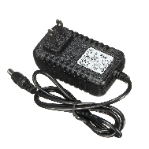

# L'électricité

## Le courant électrique

Le courant électrique est un déplacement d’électrons dans un milieu conducteur.

Pour que ces électrons se déplacent il faut créer **une différence du nombre d'électrons entre les deux extrémités du circuit électrique**. C'est ce qu'on appelle une **différence de potentiel**.

## Alimentation

Pour créer cette différence de potentiel, on utilise une **alimentation électrique** qui peut prendre la forme d'une batterie, alimentation USB, panneau solaire, prise électrique , etc.

  

Une alimentation possède deux pôles. L'un **positif** (avec un potentiel *haut*) et l'autre **négatif** (avec un potentiel *bas*). 

  

## Boucle électrique

Pour circuler, le courant doit suivre une boucle entre les deux pôles de l'alimentation.

  

## Principales grandeurs électriques

| Grandeur  | Symbole | Unité | Analogie  |
| ----------- | ----------- | ----------- | ----------- |
| Tension  | U | Volts (V) | La *pression* qui génère la circulation des électrons |
| Intensité  | I | Ampères (A) | La *quantité d’électrons* qui circule à un point |
| Résistance  | R | Ohms (Ω) | Réduit la circulation des électrons (réduit la pression et la quantité) |
| Puissance  | P | Watts (W) | La puissance résultant de la *pression* multipliée par la *quantité*  |

## Analogie de l'eau
### Pression de l'eau ≈ tension électrique

### Quantité d'eau ≈ intensité électrique

### Étranglement de tuyau ≈ intensité électrique

## Relations mathématiques entre les principales grandeurs électriques

## Vidéo complémentaire

[Electricité - C'est pas sorcier - YouTube](https://www.youtube.com/watch?v=efQW-ZmpyZs)