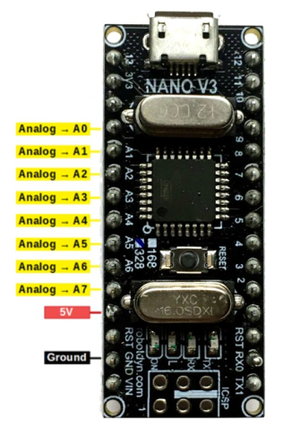
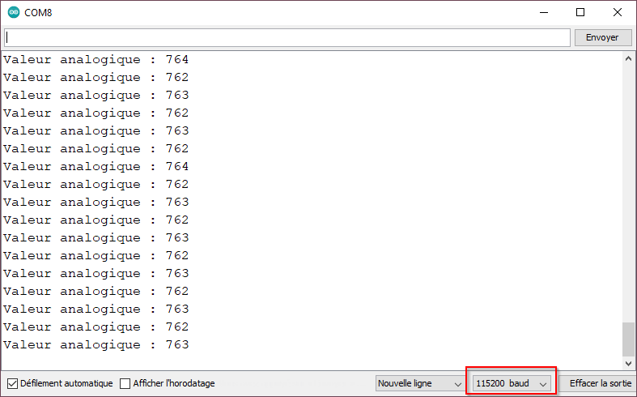

# Entrée analogique




Pour effectuer la mesure analogique de la tension électrique présente à une broche, on utilison la paire de fonctions suivantes : 
1) Configurer la broche `maBrocheAnalogique` en mode entrée avec `INPUT` :
```arduino
pinMode( maBrocheAnalogique , INPUT );
```
2) Effectuer la lecture de la broche `maBrocheAnalogique` avec `analogRead()` :
```arduino
int maLectureAnalogique = analogRead( maBrocheAnalogique );
```

La fonction `analogRead()` mesure une tension entre 0V et 5V avec une résolution de 1024 seuils. 
La valeur retournée par `analogRead()` est toujours entre 0 et 1023.

## Debogage d'une entrée analogique

Dans le code suivant, nous déboguons l'entrée analogique A1 : 
```arduino
int maBrocheEntreeAnalogique = A1;
int maValeurPrecedente; // VALEUR PRÉCÉDENTE DE L'ENTRÉE ANALOGIQUE

unsigned long monChronoDepart = 0; // DEPART DE MON CHRONOMÈTRE

void setup() { // AU DÉMARRAGE
  Serial.begin(115200); // CONFIGURER LA COMMUNICATION SÉRIE
  pinMode( maBrocheEntreeAnalogique , INPUT); // CONFIGURER LA BROCHE DE L'ENTRÉE ANALOGIQUE EN ENTRÉE
}

void loop() { // RÉPÉTER LE PLUS VITE POSSIBLE

  unsigned long monChronoEcoule = millis() - monChronoDepart; // TEMPS ÉCOULÉ DE MON CHRONOMÈTRE
  unsigned long monChronoIntervalle = 20; // INTERVALLE DE TEMPS EN MILLISECONDES

  if ( monChronoEcoule >= monChronoIntervalle ) { // SI 20 MS SE SONT ECOULEES...
     monChronoDepart = millis(); // ...REDÉMARRER LE CHRONOMÈTRE...
     
    int maNouvelleValeur = analogRead( maBrocheEntreeAnalogique ); // LECTURE DE TENSION
    
    if ( maNouvelleValeur != maValeurPrecedente ) { // SI LA NOUVELLE VALEUR EST DIFFERENTE DE LA PRÉCÉDENTE
      Serial.print( "Valeur analogique : " ); // ENVOYER UNE EN-TÊTE DE MESSAGE
      Serial.print( maNouvelleValeur ); // ENVOYER LA VALEUR
      Serial.println();  // TERMINER LE MESSAGE
    }
    
    maValeurPrecedente = maNouvelleValeur; // METTRE EN MÉMOIRE LA NOUVELLE VALEUR

  }
}
```



