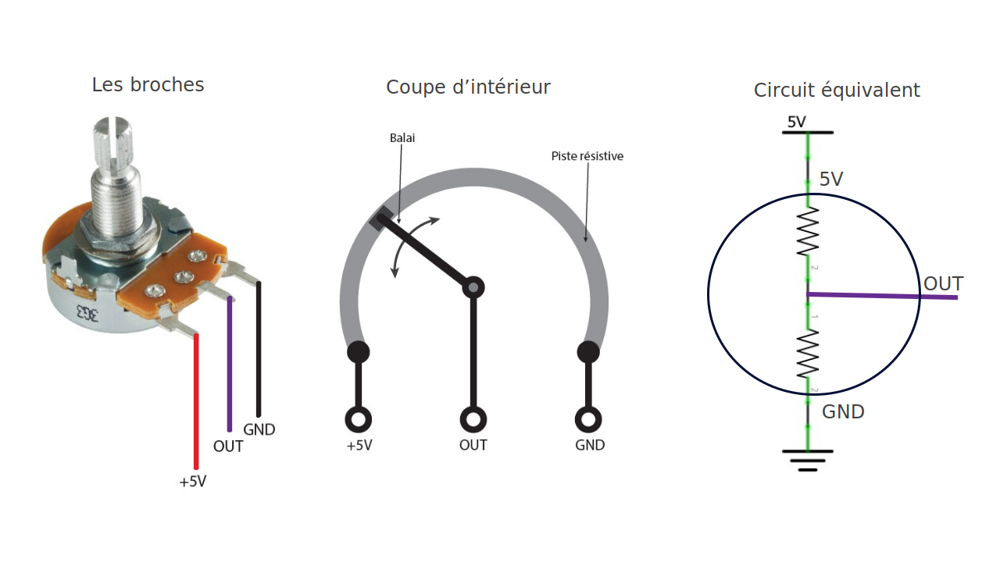
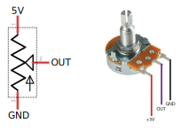
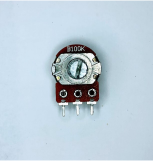
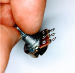
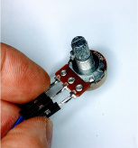

# Potentiomètre

## Connexion

Connectez le **OUT** du potentiomètre à une [entrée analogique](../entree_analogique/entree_analogique.md) de l'Arduino.

## Microsoudure du potentiomètre

{{#include ./_entree_analogique.md}}
