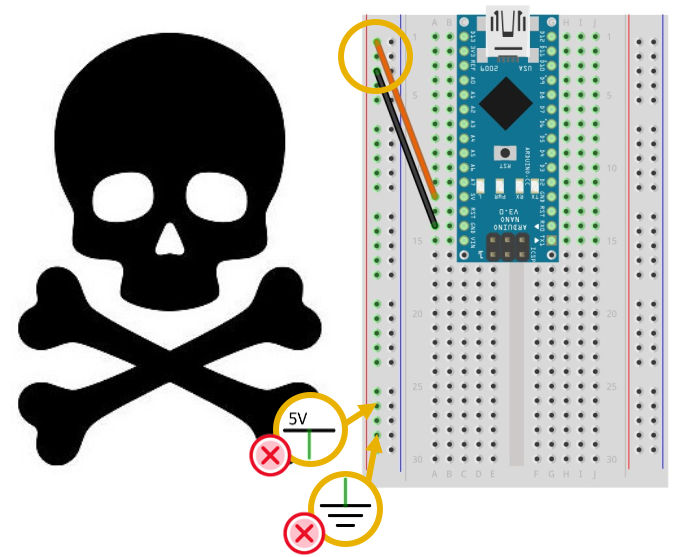
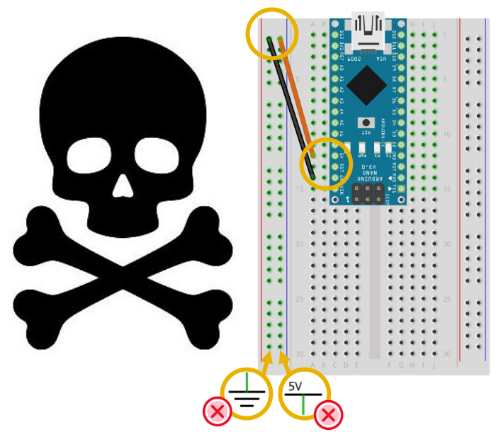

# Erreur fatale : court circuit

Ici, le pôle positif (+) et le pôle négatif (-) sont connectés dans la même colonne d'alimentation; cette erreur fatale risque d'endommager l'alimentation USB de l'ordinateur! 

# Erreur fatale : inverser les pôles + et -

Ici, le pôle positif (+) et le pôle négatif (-) sont inversés! Cette erreur fatale risque de détruire tous les composants! 

# Quoi faire en cas d'erreur fatale?

 
