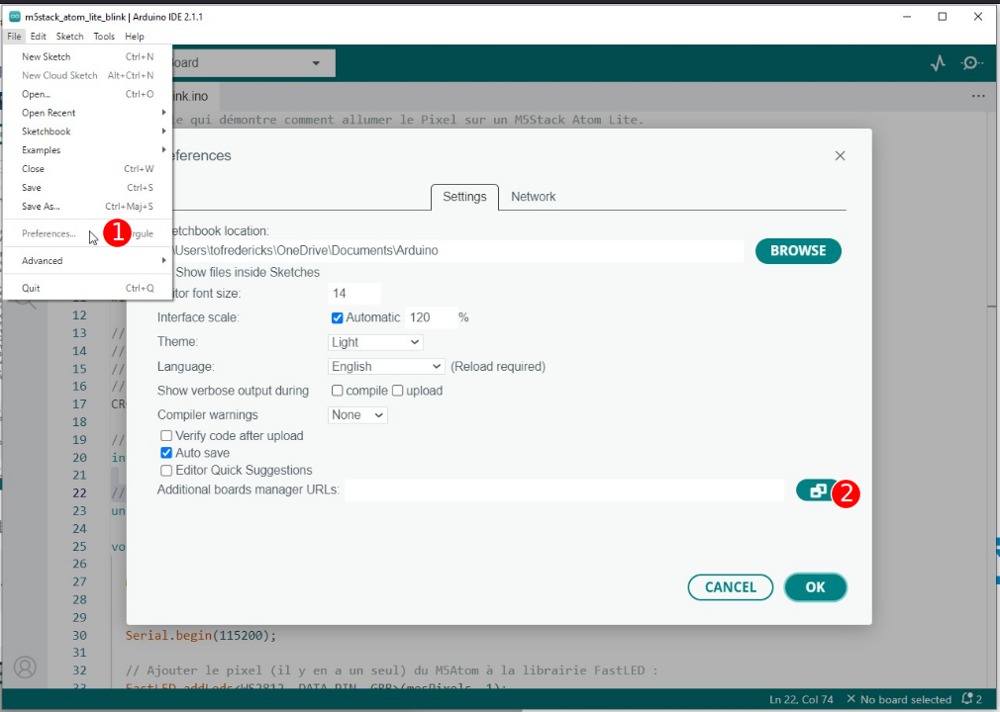
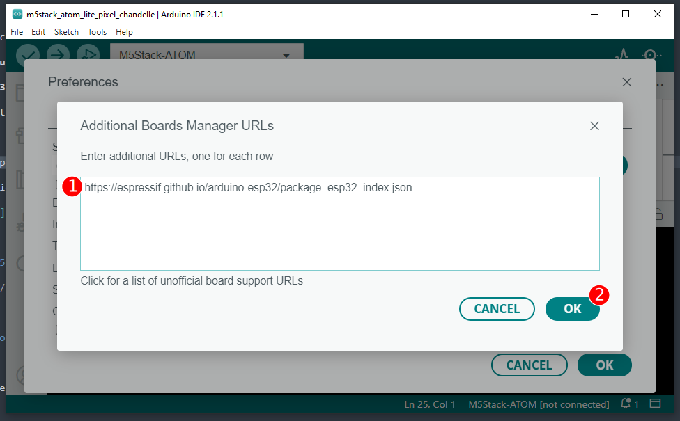
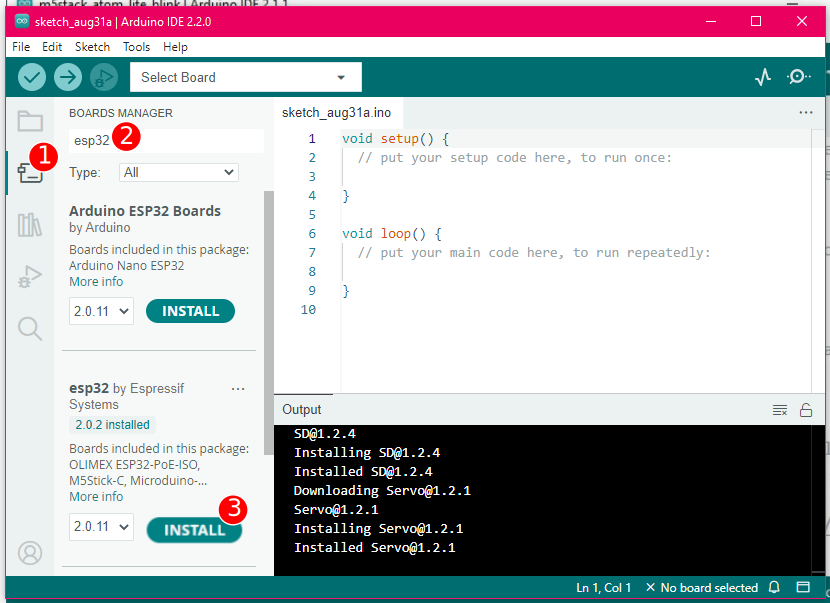
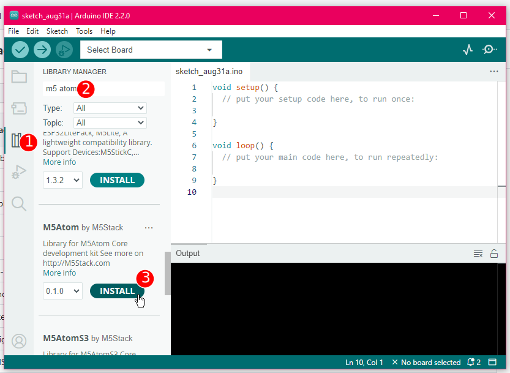
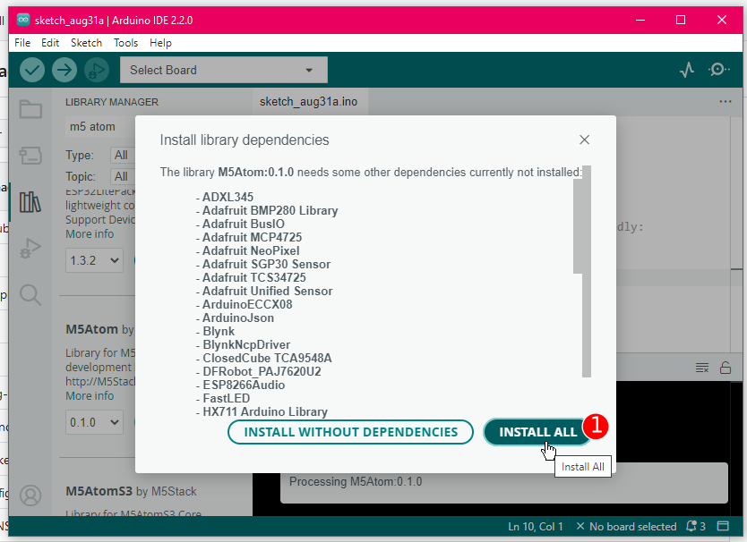
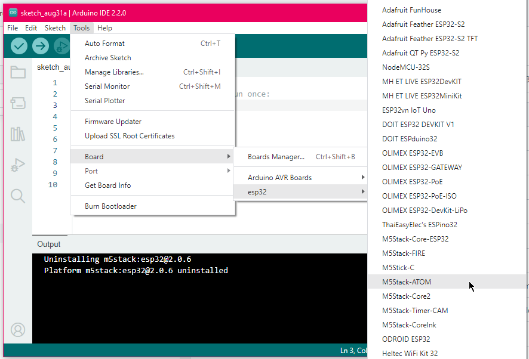
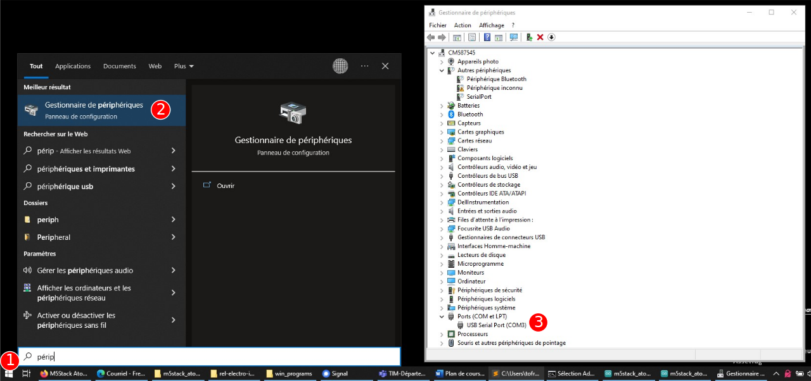
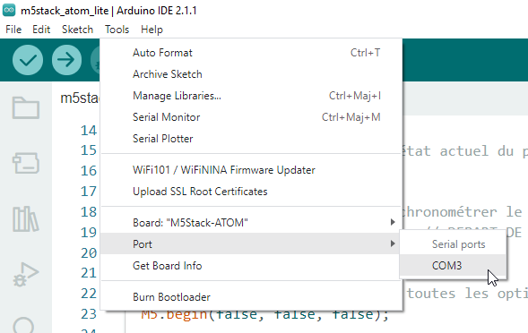

# M5Stack Atom

## Introduction

Page de produit : [ATOM Lite ESP32 IoT Development Kit | m5stack-store](https://shop.m5stack.com/products/atom-lite-esp32-development-kit)

## Broches du Atom Lite

 

## Ajouter M5Stack à Arduino (à effectuer une fois)

### Ajouter le gestionnaire de carte d'ESP32



Voici l'URL à ajouter à l'étape suivante : 
```
https://espressif.github.io/arduino-esp32/package_esp32_index.json
```




### Ajouter la librairie M5Atom





## Configurer Arduino (à vérifier à chaque utilisation)







## Code de base du Atom Lite

```arduino
{{#include ./m5stack_atom_lite_base/m5stack_atom_lite_base.ino}}
```

{{#include ./_grove_colors.md}}