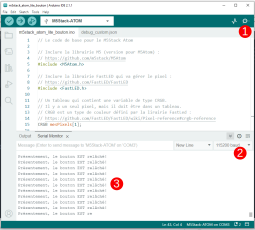

# Bouton du M5Stack Atom Lite

## Documentation de l'API du bouton du M5Stack Atom Lite

La documentation complète de l'API du bouton du M5Stack Atom Lite se trouve ici : [m5-docs](https://docs.m5stack.com/en/api/atom/button)

## Configuration dans *setup()*

Le bouton du M5Stack Atom Lite ne nécessite aucune configuration à ajouter dans *setup()*.

## Utilisation dans *loop()*

Valider si le bouton **a été** appuyé depuis le dernier *M5.update()* :
```arduino
if ( M5.Btn.wasPressed() ) {

}
```

Valider si le bouton **a été** relâché depuis le dernier *M5.update()* :
```arduino
if ( M5.Btn.wasReleased() ) {

}
```

Valider si le bouton est **présentement** appuyé :
```arduino
if ( M5.Btn.isPressed() ) {

}
```

Valider si le bouton est **présentement** relâché :
```arduino
if ( M5.Btn.isReleased() ) {

}
```

## Exemple de base pour le bouton

### Copier et coller ce code dans un nouveau document Arduino

```arduino
{{#include ./m5stack_atom_lite_bouton/m5stack_atom_lite_bouton.ino}}
```

### Observer les résultats dans le moniteur série




**Astuce** : Commenter (en d'autres mots, de désactiver) les lignes qui valident l'etat présent du bouton pour garder seulement les lignes qui indiquent si le bouton **A ÉTÉ** relâché ou appuyé, réduit considérablement la quantité de messages dans le moniteur série.

