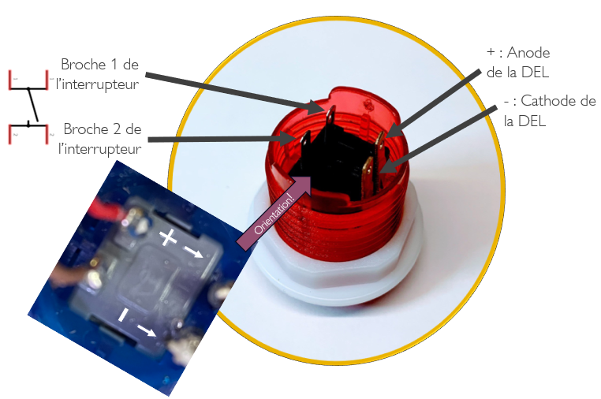
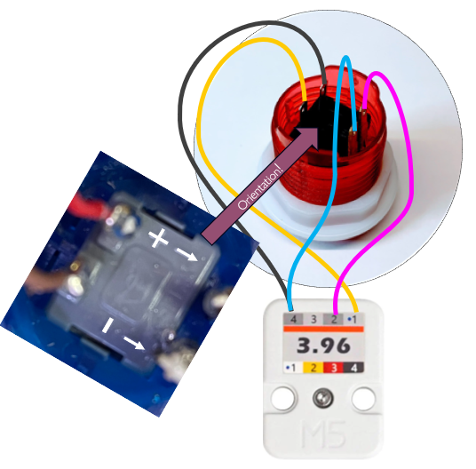

# M5Stack Unit 3.96 et bouton d'arcade

## Référence du bouton d'arcade

* Adafruit. (s. d.). Arcade Button with LED – 30mm Translucent Red. [https://www.adafruit.com/product/3489](https://www.adafruit.com/product/3489)

## Prépration





## Utilisation

### Code à ajouter à setup()

Dans `setup()`, initialiser les broches, dans ce cas-ci, les broches du ATOM Lite :
```arduino
  pinMode(32, INPUT_PULLUP);
  pinMode(26, OUTPUT);
```


### Code à utiliser dans la boucle à intervalle régulier dans loop()

Pour obtenir la valeur du bouton :
```arduino
int monEtatBouton = digitalRead(32);
```

Pour allumer la DEL du bouton :
```arduino
digitalWrite(26, 1);
```

Pour éteindre la DEL du bouton :
```arduino
digitalWrite(26, 0);
```

Pour allumer la DEL du bouton quand on appuie dessus :
```arduino
 int monEtatBouton = digitalRead(32);
    if (monEtatBouton == 1) {
      digitalWrite(26, 0);
    } else {
      digitalWrite(26, 1);
    }
```