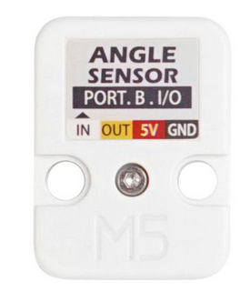

# M5Stack Angle

## Description

L'unité **M5Stack Angle** permet de mesurer une rotation conscrite entre deux angles limites.

Page de documentation officielle du produit : [m5-docs](https://docs.m5stack.com/en/unit/angle).

{{#include ./_grove_colors.md}}

## Connexion

Connecter l'unité **M5Stack Angle** au connecteur Grove blanc du contrôleur ou au connecteur noir du [PbHub](./unit_pbhub.md).

La lecture de la rotation s'effectue sur la broche identifiée par le texte *IN* sur fond blanc (câble blanc du connecteur Grove) :




Si l'unité **M5Stack Angle** est connectée au connecteur blanc du [Atom Lite](./atom_lite.md), c'est la broche 32 (identifiée G32 dans l'image suivante) qui permet d'effectuer la lecture analogique (câble blanc du connecteur Grove) :

 

## Code d'intégration pour le connecteur Grove blanc du contrôleur 

### Dans l'espace global

Bien que cela ne soit pas absolument nécessaire, c'est une bonne idée de créer une variable dans l'espace global pour conserver la valeur mesurée par le **M5Stack Angle** et un *#define* pour le numéro de la broche (n'oubliez pas de changer ce nombre pour correspondre à votre cas ) :
```arduino
#define MA_BROCHE_CAPTEUR_ROT 32
int maLectureRotation;
```

### Dans *setup()*

Le **M5Stack Angle** ne nécessite aucun code dans *setup()*.

### Dans *loop()*

Pour effectuer une lecture, *si* le **M5Stack Angle** est connecté au connecteur Grove blanc du contrôleur :

```arduino
maLectureRotation = analogRead(MA_BROCHE_CAPTEUR_ROT);
```