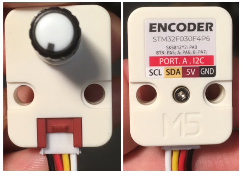

# M5Stack Unit Encoder

## Introduction



Le [M5Stack Unit Encoder](https://docs.m5stack.com/en/unit/encoder) est un capteur de rotation infinie équipé de 2 pixels RGB.

C'est un *Unit* de type I²C tel qu'identifié par son connecteur rouge.


## Bibliothèque M5Unit-Encoder

La bibliothèque [M5Unit-Encoder](https://github.com/m5stack/M5Unit-Encoder) permet d'interfacer avec le [M5Stack Unit Encoder](https://docs.m5stack.com/en/unit/encoder).

###  Installation

La bibliothèque [M5Unit-Encoder](https://github.com/m5stack/M5Unit-Encoder) est disponible dans le gestionnaire de bibliothèques d'Arduino.

### Code à ajouter à l'espace global, i.e. avant setup()

Importer la bibliothèque, créer une instance de la classe `Unit_Encoder` et créer une variable pour mémoriser la rotation précédente :
```arduino
#include "Unit_Encoder.h"
Unit_Encoder myEncoder;

int myEncoderPreviousRotation;
```

### Code à ajouter à setup()

Dans `setup()`, démarrer la connexion I2C (si elle n'a pas déjà été démarrée) et démarrer la connexion avec l'encodeur :
```arduino
Wire.begin(); // Démarrer la connexion I2C

myEncoder.begin(); // Démarrer la connexion avec l'encodeur
```

### Code à utiliser dans loop()

Obtenir la rotation accumulée de l'encodeur:
```arduino
int encoderRotation = myEncoder.getEncoderValue();
```

**Alternativement**, obtenir la rotation effectuée depuis la dernière récupération de rotation et mémoriser cette valeur dans `encoderRotationChange`:
```arduino
int encoderRotation = myEncoder.getEncoderValue();
int encoderRotationChange = encoderRotation - myEncoderPreviousRotation;
myEncoderPreviousRotation = encoderRotation;
```

Obtenir l'état du bouton (0=appuyé, 1=relâché):
```arduino
  int encoderButton = myEncoder.getButtonStatus();
```

Changer la couleur du **premier** pixel en blanc ([la couleur est en valeur hexadécimale](https://htmlcolorcodes.com/color-picker/) où le symbole # est remplacé par 0x) :
```arduino
myEncoder.setLEDColor(1, 0xFFFFFF);
```

Changer la couleur du **deuxième** pixel en noir ([la couleur est en valeur hexadécimale](https://htmlcolorcodes.com/color-picker/) où le symbole # est remplacé par 0x) :
```arduino
myEncoder.setLEDColor(2, 0x000000);
```

Exemples de couleurs hexadécimales en C++ :
```arduino
uint32_t rouge = 0xFF0000;
uint32_t orange = 0xFF8800;
uint32_t vert = 0x00FF00;
uint32_t cyan = 0x00FFFF;
uint32_t mauve = 0xFF00FF;
```

##  Exemple avec M5Unit-Encoder
```arduino
{{#include ./mstack_atom_encoder/mstack_atom_encoder.ino}}
```