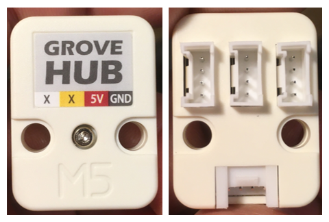
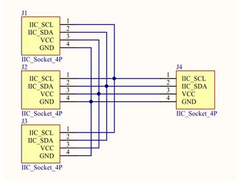
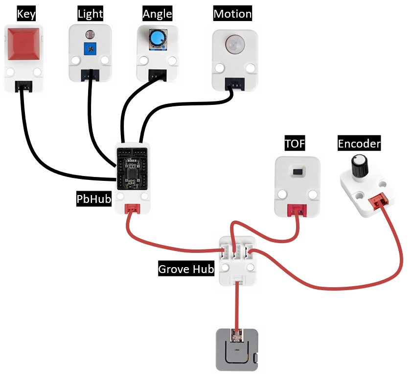

# M5Stack Unit Grove Hub

## Introduction

Le [M5Stack Unit Grove Hub(1 to 3 HUB Expansion Unit)](https://docs.m5stack.com/en/unit/hub) permet de connecter 3 Units I²C **avec des adresses différentes (par défaut, cela veut dire 3 modules I²C différents!)**. Si vous connectez des appareils I²C sur un M5Stack Grove Hub partageant la même adresse, vous aurez du mal à obtenir les données I²C des deux. Les adresses I²C des appareils doivent être différentes. Si vous modifiez l'adresse I²C d'un Unit, n'oubliez pas d'inscrire sa nouvelle adresse sur son boîtier sinon vous pourriez ne plus le contrôler!

Le [M5Stack Unit Grove Hub (1 to 3 HUB Expansion Unit)](https://docs.m5stack.com/en/unit/hub) un *Unit* passif (il ne transforme pas le signal et n'est pas allimenté). Il fait juste connecter 4 connecteurs Grove entre-eux électriquement.

## Exemple de connexions

