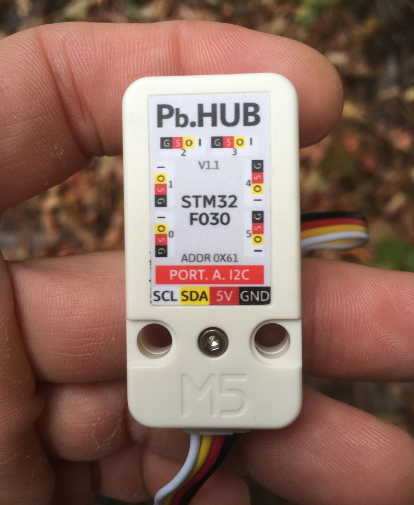
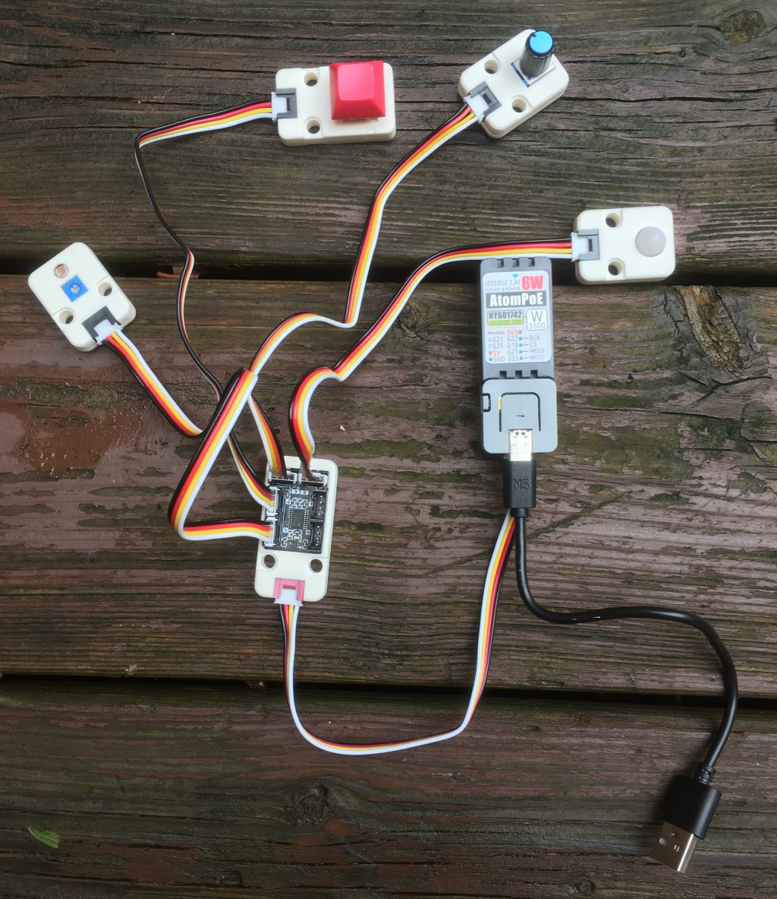

# M5Stack UNIT PbHub

## Introduction

Le [M5Stack PbHub v1.1](https://docs.m5stack.com/en/unit/pbhub_1.1) permet de relier jusqu'à 6 M5Stack UNITS équipés d'un connecteur **noir** au même microcontrôleur M5Stack.




## Bibliothèque M5_PbHub

La bibliothèque M5_PbHub permet d'interfacer avec le [M5Stack PbHub v1.1](https://docs.m5stack.com/en/unit/pbhub_1.1).

###  Installation

La bibliothèque [M5_PbHub](https://github.com/thomasfredericks/M5_PbHub) est disponible dans le gestionnaire de bibliothèques d'Arduino.

### Code à ajouter à l'espace global (i.e. avant `setup()` )

```arduino
#include <M5_PbHub.h>
M5_PbHub myPbHub;
```

### Code à ajouter à `setup()`

Cette ligne de code doit être ajoutée à `setup()`):
```arduino
myPbHub.begin();
```

Si un UNIT avec des pixels est connectée au PbHUB, vous devez idéalement initialiser le nombre de pixels dans `setup()`:
```arduino
myPbHub.setPixelCount( uint8_t channel ,  uint16_t count );
```

### Code à utiliser dans `loop()`

Obtient la valeur numérique (0 ou 1) de la broche *I* du canal indiqué:
```arduino
int value = myPbHub.digitalRead(uint8_t channel);
```

Écrit une valeur numérique (0 ou 1) sur la broche *O* du canal indiqué:
```arduino
myPbHub.digitalWrite(uint8_t channel, uint8_t  value);
```

Obtient la valeur analogique de la broche *I* du canal indiqué:
```arduino
int value = myPbHub.analogRead(uint8_t channel);
```

Définit le PWM de la broche *O* du canal indiqué:
```arduino
myPbHub.analogWrite(uint8_t channel, uint8_t pin, uint8_t  pwm);
```

Définit la couleur r, g, b du pixel à cet index du canal indiqué:
```arduino
myPbHub.setPixelColor(uint8_t channel, uint16_t index, uint8_t r,int8_t g, uint8_t b);
```

À partir de pixel à cet index, définit la même couleur r, g, b  d'un certain nombre de pixels du canal indiqué: 
```arduino
myPbHub.fillPixelColor(uint8_t channel, uint16_t start, uint16_t index, uint8_t r,int8_t g, uint8_t b);
```

### Exemple avec débogage série



```arduino


// Inclure la librairie M5 (version pour M5Atom) :
// https://github.com/m5stack/M5Atom
#include <M5Atom.h>

// Inclure la librairie FastLED qui va gérer le pixel :
// https://github.com/FastLED/FastLED
#include <FastLED.h>

// Un tableau qui contient une variable de type CRGB.
// Il y a un seul pixel, mais il doit être dans un tableau.
// CRGB est un type de couleur défini par la lirairie FastLed :
// https://github.com/FastLED/FastLED/wiki/Pixel-reference#crgb-reference
CRGB mesPixels[1];

#include <M5_PbHub.h>
M5_PbHub myPbHub;

#define KEY_UNIT_CHANNEL 4
#define ANGLE_UNIT_CHANNEL 3
#define PIR_UNIT_CHANNEL 2
#define LIGHT_UNIT_CHANNEL 1

unsigned long monChronoDepart = 0;

void setup() {
  // Démarrer la libraire M5 avec toutes les options de pré-configuration désactivées :
  M5.begin(false, false, false);

  // Démarrer la connexion sérielle :
  Serial.begin(115200);

  // Ajouter le pixel (il y en a un seul) du M5Atom à la librairie FastLED :
  FastLED.addLeds<WS2812, DATA_PIN, GRB>(mesPixels, 1);

  myPbHub.begin();

  myPbHub.setPixelCount(KEY_UNIT_CHANNEL, 1);
}

void loop() {
  // TOUJOURS inclure M5.update() au début de loop() :
  M5.update();

  if (millis() - monChronoDepart >= 50) {  // SI LE TEMPS ÉCOULÉ DÉPASSE 50 MS...
    monChronoDepart = millis();            // ...REDÉMARRER LE CHRONOMÈTRE...

    Serial.print("KEY: ");
    int maValeurKey = myPbHub.digitalRead(KEY_UNIT_CHANNEL);
    Serial.print(maValeurKey);

    // Allumer le pixel du KEY si son bouton est appuyé
    myPbHub.setPixelColor(KEY_UNIT_CHANNEL, 0, maValeurKey * 255, maValeurKey * 255, maValeurKey * 255);

    Serial.print(" ANGLE: ");
    int maValeurAngle = myPbHub.analogRead(ANGLE_UNIT_CHANNEL);
    Serial.print(maValeurAngle);

    Serial.print(" PIR: ");
    int maValeurPir = myPbHub.analogRead(PIR_UNIT_CHANNEL);
    Serial.print(maValeurPir);

    Serial.print(" LIGHT: ");
    int maValeurLight = myPbHub.analogRead(LIGHT_UNIT_CHANNEL);
    Serial.print(maValeurLight);
    Serial.println();

  }
}
```