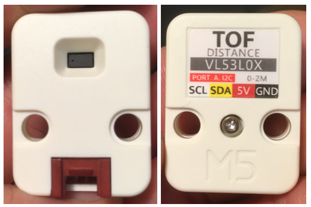

# M5Stack Unit TOF

## Introduction



Le [M5Stack Unit TOF](https://docs.m5stack.com/en/unit/tof) permet de mesurer des distances jusqu'à 2 mètres avec la technologie *Time of Flight*. 

C'est un *Unit* de type I²C tel qu'identifié par son connecteur rouge.


## Bibliothèque vl53l0x-arduino de Polulu 


La bibliothèque [vl53l0x-arduino](https://github.com/pololu/vl53l0x-arduino) de Polulu permet d'interfacer avec le [M5Stack Unit TOF](https://docs.m5stack.com/en/unit/tof).

###  Installation

La bibliothèque [vl53l0x-arduino](https://github.com/pololu/vl53l0x-arduino) est disponible dans le gestionnaire de bibliothèques d'Arduino.

### Code à ajouter à l'espace global, i.e. avant setup()

Importer la bibliothèque et créer une instance de la classe `VL53L0X` :
```arduino
#include <VL53L0X.h>
VL53L0X myTOF;
```

### Code à ajouter à setup()

Dans `setup()`, démarrer la connexion I2C (si elle n'a pas déjà été démarrée), initialiser le TOF, définir un *timeout* et démarrer la lecture en continue du TOF :
```arduino
  Wire.begin();

  myTOF.init();
  myTOF.setTimeout(500);
  myTOF.startContinuous();
```


### Code à utiliser dans loop()

Obtenir la mesure en millimètres :
```arduino
uint16_t value = myTOF.readRangeContinuousMillimeters();
```

Déterminer s'il y a eu une erreur de communication avec le TOF :
```arduino
int error = myTOF.timeoutOccurred();
```

##  Exemple avec vl53l0x-arduino
```arduino
{{#include ./mstack_atom_lite_tof/mstack_atom_lite_tof.ino}}
```
