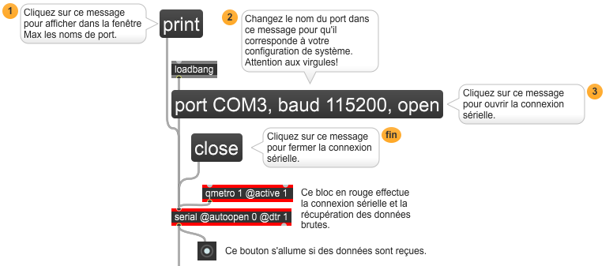
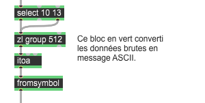
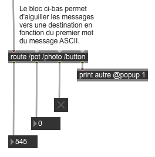

# Réception série ASCII dans Max

## Réception des données sérielles dans Max

Pour recevoir les données sérielles dans Max, il faut avant tout initialiser l'objet [serial]. 

.

## Conversion des données brutes en message ASCII

Ensuite, il faut :
* Identifier la fin d'un message lors de la réception du nombre brut 10 à l'aide d'un [select].
* Accumuler les données brutes dans une liste avec [zl group].
* Convertir la liste de données brutes en message ASCII avec la combinaison de [itoa] et [fromsymbol].

.

## Aiguillage des messages selon leur identifiant

Finalement, lorsque les messages sont reconstitués, il est possible de les aiguiller vers leurs destinations  avec un [route].

.

## Patcher complet

Pour télécharger le patcher au complet, cliquer [ici](./max_ascii.maxpat).