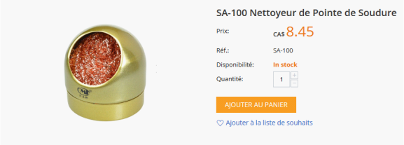
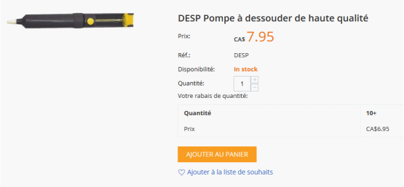

# Micro-soudure

## Équipement essentiel

## Tutoriels

* [Tutoriel sous form de bande dessinée: SOUDER C'EST FACILE](./micro-soudure/bd_soudure.pdf)
* [Vidéo d'introduction sur la soudure par KidzLab](https://vimeo.com/481700117/fe056befd2)

### Résumé de la technique de pointe

