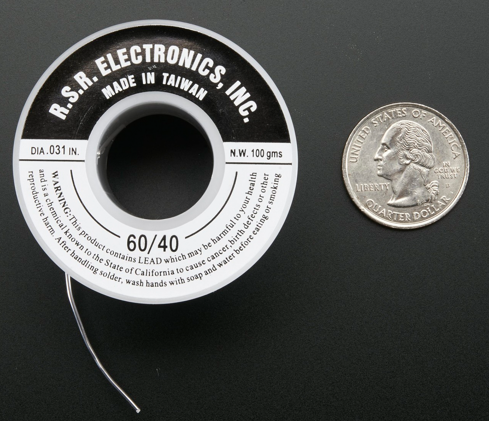

# Micro-soudure

## Équipement essentiel

## Technique

## Informations complémentaires

* Altman, M. (s. d.). Souder c’est facile : voici comment faire (A. Nordgren, ill.; J. Keyzerm éd.; Snootlab, trad.). [bd_soudure.pdf](../pdf/bd_soudure.pdf)
* Earl. B. (2012, 6 septembre). Common Soldering Problems. Adafruit. [https://learn.adafruit.com/adafruit-guide-excellent-soldering/preparation](https://learn.adafruit.com/adafruit-guide-excellent-soldering/preparation)
* Earl. B. (2012, 6 septembre). Making good solder joint. Adafruit. [https://learn.adafruit.com/adafruit-guide-excellent-soldering/making-a-good-solder-joint](https://learn.adafruit.com/adafruit-guide-excellent-soldering/making-a-good-solder-joint)
* Earl. B. (2012, 6 septembre). Preparation. Adafruit. [https://learn.adafruit.com/adafruit-guide-excellent-soldering/preparation](https://learn.adafruit.com/adafruit-guide-excellent-soldering/preparation)
* Earl. B. (2012, 6 septembre). Tools. Adafruit. [https://learn.adafruit.com/adafruit-guide-excellent-soldering/tools](https://learn.adafruit.com/adafruit-guide-excellent-soldering/preparation)
* Montuelle, C. (s. d.). Introduction à la soudure électrique [vidéo]. Vimeo. [https://vimeo.com/481700117/fe056befd2]( https://vimeo.com/481700117/fe056befd2) 

## Sources des images

* ADAFRUIT. (s. d.). Mini Solder spool - 60/40 lead rosin-core solder 0.031" diameter - 100g. [https://www.flickr.com/photos/adafruit/39675740312](https://www.flickr.com/photos/adafruit/39675740312) 
* JOEL_E_B. (s. d.). How to Solder : Through-Hole Soldering. Sparkfun. [https://learn.sparkfun.com/tutorials/how-to-solder-through-hole-soldering/all](https://learn.sparkfun.com/tutorials/how-to-solder-through-hole-soldering/all )
