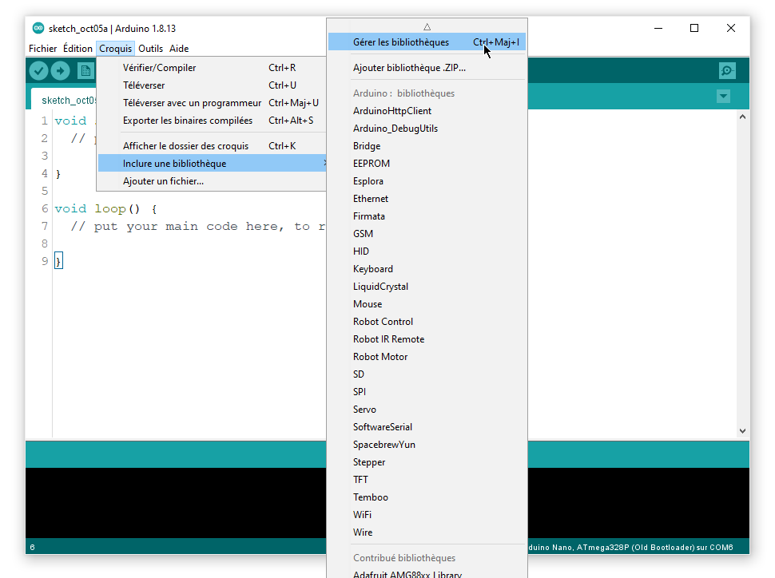

# MicroOsc

**MicroOsc** est une bibliothèque pour Arduino permettant à la plaquette de communiquer en OSC par SLIP ou UDP.

## Installation

## Documentation

La documentation (en anglais) se trouve sur le [GitHub de la bibliothèque MicroOsc](https://github.com/thomasfredericks/MicroOsc).