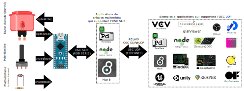

# OSC SLIP : MicroOsc

## Problématique


Nous voulons une méthode robuste, fiable et universelle pour l'intégration de l'Arduino à l'espace immersif dans un contexte de création multimédia. C'est-à-dire l’intégration de capteurs et actionneurs dans un grand espace où l'ordinateur multimédia, qui doit coordonner les aspects audiovisuels (les projections visuelles, les éclairages, les effets et les diffusions sonores), est distant.


## Solution de connectique

La solution proposée essaie de rester peu onéreuse et accessible tout en demeurant fiable (en éliminant les sources d’erreurs potentielles des communications) et très compatible avec les outils de création multimédia.

Dans cette optique, nous choisissons d'utiliser le protocole [OSC](../osc/osc.html). La plupart des protocoles (COBS, JSON, FUDI, etc.) permettent une trop grande latitude dans la manière d'organiser les données, et s'appuient donc sur des architectures personnalisées spécifiques à chaque développeur. L'OSC impose une structure particulière de l'information que toutes les applications doivent supporter ce qui rend toute communication plus universelle : tout le monde parle la même langue!

Idéallement, nous utiliserions l'OSC UDP qui voyage par Ethernet. Cependant, parfois un réseau est inacessible ou même certains microcontrôleurs ne possèdent pas de connecteur Ethernet (ou Wi-Fi) et ne permettent pas d'envoyer des messages OSC UDP. Il est donc nécessaire d'utiliser des messages OSC SLIP, qui voyagent par USB série, et de communiquer avec une application qui supporte OSC SLIP ou de relayer les mesages OSC SLIP en OSC SLIP avec des relais OSC SLIP ⇄ UDP.



## MicroOsc SLIP

### Code à ajouter à l'espace global

Il faut ajouter la bibliothèque *MicroOscSlip* qui fait partie de *MicroOsc* et initialiser une instance de MicroOscSlip : 
```arduino
#include <MicroOscSlip.h>
// The number 64 between the < > below  is the maximum number of bytes reserved for incomming messages.
// Outgoing messages are written directly to the output and do not need more reserved bytes.
MicroOscSlip<64> myMicroOsc(&Serial);
```

### Code à ajouter à *setup()*

Il n'y a rien de spécial à ajouter à *setup()* sauf un rappel qu'il est nécessaire d'avoir unitialisé la communication sérielle si elle ne l'a pas été faite avec `Serial.begin(115200);`.


## Fonction personnalisée à ajouter avant *loop()*

Il est nécessaire de définir une fonction qui va être appelée lorsqu'un nouveau message OSC va être reçu :

```arduino
// FUNCTION THAT WILL BE CALLED WHEN AN OSC MESSAGE IS RECEIVED:
void myOscMessageParser( MicroOscMessage& receivedOscMessage) {
   // ADD MESSAGE PARSING CODE HERE
}
```

Dans cette fonction l'adresse du message peut être validée avec *checkOscAddress()* ainsi :
```arduino
if ( receivedOscMessage.checkOscAddress("/address") ) {
	// MESSAGE ADDRESS IS "/address"
}
```

Lorsque l'adresse du message a été validée, il est possible de récuprer les données.Par exemple, pour récupérer un entier:
```arduino
int32_t intArgument = receivedOscMessage.nextAsInt();
```


### Code à intégrer dans *loop()*


Dans *loop()* nous devons déclencher la réception des messages OSC avec la méthode *onOscMessageReceived()* à laquelle nous passons le nom de la fonctione personnalisée créée précédemment:

```arduino
myMicroOsc.onOscMessageReceived( myOscMessageParser );
```

Nous pouvons aussi envoyer des messages, par exemple un entier ainsi :
```arduino
int myIntToSend = 100;
myMicroOsc.sendInt("/address", myIntToSend);
```


## Exemple MicroOsc SLIP pour M5Stack Atom Lite

L'exemple suivant montre comment envoyer et recevoir de l'OSC SLIP avec un Atom Lite. 

Messages reçus par l'Arduino :
- `/led int` -> éteint (0) ou allume (1) le pixel en blanc
- `/pixel int int int` -> change la couleur RGB (0-255 pour chaque couleur)

Messages envoyés par l'Arduino :
- `/pot int` -> envoie la valeur de rotation du M5Stack Agnle Unit
- `/button int` -> envoie un 1 si le bouton est appuyé et un 0 sinon

### Composants requis

* [M5Stack Atom Lite](../m5stack/atom_lite.html)
* [M5Stack Angle Unit](../m5stack/unit_angle.html)

### Code

```arduino
{{#include ./m5stack_atom_lite_microosc_slip/m5stack_atom_lite_microosc_slip.ino}}
```

## Exemple MicroOsc SLIP pour Arduino Nano (ou similaire)

### Composants requis

* Arduino Nano (ou similaire)
* Potentiomètre
* Photorésistance et résitance adéquate
* Bouton d'arcade illuminé


### Schéma du circuit


### Illustration du circuit


### Code OSC SLIP avec MicroOsc pour la démonstration

```arduino
{{#include ../osc_espace_immersif/MicroOsc_Demo_SLIP/MicroOsc_Demo_SLIP.ino}}
```