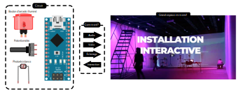

# OSC UDP : MicroOsc

## Problématique



Nous voulons une méthode robuste, fiable et universelle pour l'intégration de l'Arduino à l'espace immersif dans un contexte de création multimédia. C'est-à-dire l’intégration de capteurs et actionneurs dans un grand espace où l'ordinateur multimédia, qui doit coordonner les aspects audiovisuels (les projections visuelles, les éclairages, les effets et les diffusions sonores), est distant.


## Solution de connectique

La solution proposée essaie de rester peu onéreuse et accessible tout en demeurant fiable (en éliminant les sources d’erreurs potentielles des communications) et très compatible avec les outils de création multimédia.

Dans cette optique, nous choisissons d'utiliser le protocole [OSC](../osc/osc.html). La plupart des protocoles (COBS, JSON, FUDI, etc.) permettent une trop grande latitude dans la manière d'organiser les données, et s'appuient donc sur des architectures personnalisées spécifiques à chaque développeur. L'OSC impose une structure particulière de l'information que toutes les applications doivent supporter ce qui rend toute communication plus universelle : tout le monde parle la même langue!

Dans ce cas-ci, nous allons utiliser la version UDP de l'OSC. Pour établir cette connexion, vous devez :
1. Établir une connexion UDP
2. Intégrer MicroOsc UDP

## Connexion UDP

Il est possible d'établir une connexion UDP de deux manières:
* Une connexion UDP par Ethernet, plus fiable et simple.
* Une connexion UDP par WiFi, moins fiable et plus complexe.

### Connexion UDP Ethernet

#### Code à ajouter à l'espace global pour une connexion UDP Ethernet

**Modifiez les adreses et les ports pour que cela corresponde à votre configuration réseau**!

```arduino
#include <SPI.h>
#include <Ethernet.h>
#include <esp_mac.h>
EthernetUDP myUdp;

IPAddress myDestinationIp(10, 1, 2, 3);
unsigned int myDestinationPort = 7001;

IPAddress myIp(10, 1, 2, 101);
unsigned int myPort = 7000;
```

#### Code à ajouter à *setup()* pour une connexion UDP Ethernet

Initialisation et configuration de la connexion Etheret UDP :
```arduino
// CONFIGURE ETHERNET HARDWARE :
  // THE NUMBERS ARE THE HARDWARE PINS FOR THE ATOM POE.
  SPI.begin(22, 23, 33, 19);
  Ethernet.init(19);
  // GET FACTORY DEFINED ESP32 MAC :
  uint8_t myMac[6];
  esp_efuse_mac_get_default(myMac);
  // START ETHERNET WITH STATIC IP
  Ethernet.begin(myMac, myIp);
  myUdp.begin(myPort);

  Serial.println();
  Serial.println(__FILE__);
  Serial.print("myDestinationIp: ");
  Serial.println(myDestinationIp);
  Serial.print("myDestinationPort: ");
  Serial.println(myDestinationPort);
  Serial.print("myIp: ");
  Serial.println(Ethernet.localIP());
  Serial.print("myPort: ");
  Serial.println(myPort);
```

## MicroOsc UDP

### Code à modifier ou ajouter à l'espace global pour MicroOsc UDP

Le code pour *MicroOscUdp* doit être ajouté dans l'espace global après l'initialisation des variables précédentes.

Si *MicroOscSlip* était utilisé, il faut commenter pour désactiver les lignes suivantes :
```arduino
// #include <MicroOscSlip.h>
// MicroOscSlip<1024> myOsc(&Serial);
```

Il faut ajouter la bibliothèque *MicroOscUdp* qui fait partie de *MicroOsc* et initialiser une instance de MicroOscUdp : 
```arduino
#include <MicroOscUdp.h>
// The number 1024 between the < > below  is the maximum number of bytes reserved for incomming messages.
// Outgoing messages are written directly to the output and do not need more reserved bytes.
MicroOscUdp<1024> myOsc(&myUdp, myDestinationIp, myDestinationPort);
```

### Code à ajouter à *setup()* pour MicroOsc UDP

{{#include ./_osc_common.md}}

## Exemple MicroOsc UDP Ethernet à adresse statique pour M5Stack Atom Lite

L'exemple **microosc_ethernet_static_m5stack_atom_poe** dans les [exemples de MicroOs pour M5Stack Atom](https://github.com/thomasfredericks/MicroOsc/tree/main/examples/m5stack-atom) démontre comment effectuer l'intégration de MicroOsc UDP à une connexion Ethernet avec une adresse statique.
