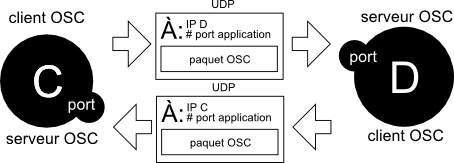

# Open Sound Control (OSC)

L'*Open Sound Control* (OSC) est un protocole de communication inter-applications. Contrairement à ce qu'indique son nom, il ne concerne pas uniquement le son, mais offre un système d'organisation générique mais uniformisé de l'information pertinent au contrôle de n'importe quel système, multimédia ou pas. L'OSC a été développé à UC Berkeley Center for New Music and Audio Technology (CNMAT).

## Pourquoi l'OSC? 

La plupart des protocoles (COBS, JSON, FUDI, etc.) permettent une trop grande latitude dans la manière d'organiser les données, et s'appuient donc sur des architectures personnalisées spécifiques à chaque développeur. L'OSC impose une structure particulière de l'information que toutes les applications doivent supporter ce qui rend toute communication plus universelle : tout le monde parle la même langue!

L'OSC fournit également une vérification (primitive) des erreurs de transmission, ce qui est très important lorsque l'on travaille avec flux susceptibles au bruit!

## Client et serveur

* Une application qui envoie de l'OSC est un **client OSC**. 
* Une application qui reçoit de l'OSC est un **serveur OSC**. 
* Habituellement, toutes les applications qui supportent l'OSC sont *client OSC* et *serveur OSC* (elles peuvent donc supporter la réception et l'envoi de messages OSC).

## Unité de transmission

* L'unité de transmission de l'OSC est le **message** ou le **bundle**. Un **bundle** contient un ou plusieurs messages et un **timetag**.
* L'OSC est unidirectionnel et n'offre pas d'accusé de réception (on ne sait pas si le destinataire a reçu le message).

## Paquetage

L'OSC ne définit pas la mise en paquet des messages. 

Les deux types de paquets les plus communs sont:
* **UPD** (le mode par défaut) pour la communication par réseau ou interne de l'ordinateur
* **SLIP** (souvent nommé **OSC SLIP**) pour la communication par série (USB) avec des microcontrôleurs plus vieux

### Par UDP

De façon générale, l'OSC est envoyé sur un réseau par *UDP*. 

Pour envoyer un message, il faut spécifier l'adresse UDP du destinataire. Cette adresse se compose de deux parties:
* IP de la machine adressée.
* Port du client OSC.

Pour recevoir un message , il faut simplement spécifier le port de réception.

### Par SLIP

Le *SLIP* ne permet pas d'adresser les messages à des destinataires spécifiques. Seule l'application qui est connectée au port série peut envoyer et recevoir des messages (qu'elle peut relayer par la suite par UDP si nécessaire).

## Exemples d'architectures

### Un client sur une machine -> un serveur sur une autre machine


### Une machine <-> une autre machine



### Un client -> un serveur sur la même machine

L'architecture suivante  permet d'envoyer un message entre deux applications différentes sur la même machine (ou à l'intérieur de la même application). L'adresse IP **127.0.0.1** veut dire «la machine elle-même».


## Composition d'un bundle OSC

Un bundle OSC contient plusieurs messages OSC. Il sert surtout à s'assurer que plusieurs messages arrivent simultanément au destinataire. 


## Composition d'un message OSC

Un message OSC est composé des éléments suivants:
* une **adresse**
* un ou plusieurs **arguments**

### Adresse

L'adresse indique quel est le paramètre que l'on veut modifier. Elle peut être composée de n'importe quelle lettre et chiffre. Par contre, voici quelques recommandations à suivre lorsque vous concevez votre propre serveur OSC:
* Une adresse doit toujours commencer par `/`
* Chaque `/` subdivise l'adresse en hiérarchie symbolique. Plus une subdivision se trouve au début, plus est elle haute dans hiérarchie. Prenons comme exemple `/A/B` : `A` englobe `B` et `B` fait partie de `A`.
* Tous les *espaces* doivent être remplacés par des `_`

Quelques exemples: 
```
/application/fenetre/bouton
/torse/bras/main/doigt/index
/renoise/pattern_name
```

### Arguments


Chaque argument possède un type. Il existe quatre types de base :
* *int* : nombre entier à 32 bit.
* *float* : nombre à virgule à 32 bit.
* *string* : chaîne de caractères.
* *blob* : un tableau d'octets (byte).

Un message OSC peut mélanger plusieurs types d'arguments différents et peut contenir n'importe quel nombre d'arguments. 

Quelques exemples: 
```
/application/fenetre/bouton 1
/torse/bras/main/doigt/index 0.324
/renoise/pattern_name intro 43
```

Voici quelques recommandations à suivre lorsque vous concevez votre propre serveur OSC:
* Essayez de réduire le nombre d'arguments au profit d'un adressage plus complet. Cela respecte mieux la hiérarchie de l'adressage et plusieurs serveurs OSC ne supportent qu'un seul argument à la fois. Par exemple, utilisez `/piste/0/vol 1.` a un seul argument plutôt que `/piste/vol 0 1.` à deux arguments.
* Utilisez autant que possible des nombres réels normalisées entre `0.` et `1.` pour plus de compatibilité.

### Annexe d'applications supportant l'OSC

* https://sensors2.org/osc/