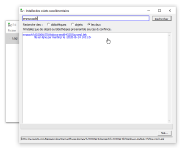
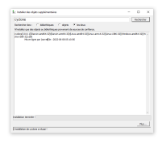

# OSC SLIP dans Pure Data

## Installation de Pure Data

Téléchargez la version appropriée pour votre système ici (si possible la version avec installateur) : [puredata.info/downloads/pure-data](https://puredata.info/downloads/pure-data)

## Installation des objets additionnels pour l'OSC SLIP dans Pure Data

Pour faire fonctionner l'OSC SLIP il est nécessaire d'ajouter des collections d'objets à Pure Data:
* mrpeach
* comport
* cyclone (pas absolument nécessaire mais très utile)

## Patcher pour le traitement de l'OSC SLIP directement dans Pure Data

