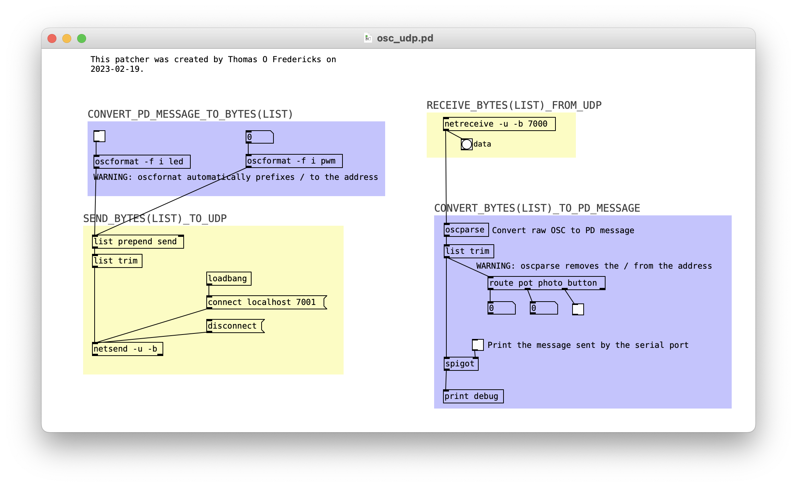

# OSC UDP : Pure Data

## Installation de Pure Data

Télécharger la version appropriée pour votre système ici (si possible la version avec installateur) : [puredata.info/downloads/pure-data](https://puredata.info/downloads/pure-data)

## Patcher Pure Data pour traiter directement l'OSC UDP

