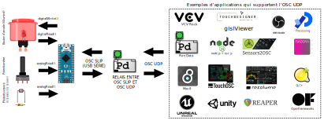

# Relais OSC SLIP ⇄ OSC UDP avec Pure Data

Pure Data peut être utilisé pour relayer les messages OSC entre une source SLIP et une source UDP. Cela permet d'ajouter la communication OSC UDP à un microcontrôleur qui ne possède d'habitude pas cette capacité.

## Prérequis

Assurez-vous d'avoir suivi les instruction dans la section [OSC SLIP avec Pure Data (PD)](./osc_slip.md).

## Patcher Pure Data pour le relais des messages OSC SLIP ⇄ UDP 

