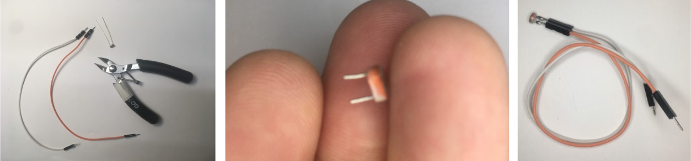

# Photorésistance

## Connexion avec un diviseur de tension

La photorésistance nécessite un circuit de diviseur de tension pour être connectée à l'Arduino. Connectez le **OUT** à une [entrée analogique](../entree_analogique/entree_analogique.md) de l'Arduino. <!-- pour uniformiser le texte, metrre connect(er)  -->

## Information complémentaire sur les diviseurs de tension

* [Voltage Dividers - SparkFun Learn](https://learn.sparkfun.com/tutorials/voltage-dividers)

## Microsoudure de la photorésistance

