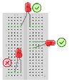
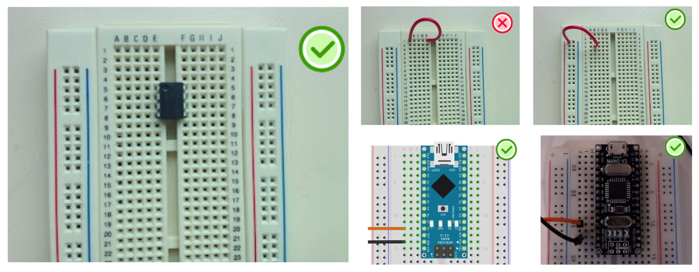
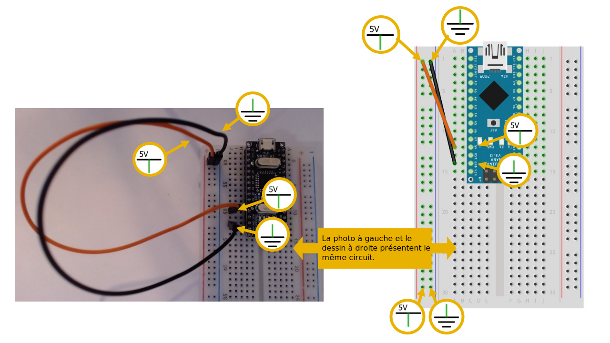

# Platine d'expérimentation (*breadboard*)

Une platine d’expérimentation (*breadboard* en anglais) permet de réaliser des prototypes de circuits électroniques sans soudure et donc de pouvoir réutiliser les composants.

À gauche, dans l'image ci-haut, nous trouvons le circuit électrique pour allumer une lumière DEL à partir de la carte Arduino. Par contre, il est impossible de relier les composants sans faire de soudure. C’est pour cela que nous utilisons la platine d’expérimentation. 

## Connexions

Certains des trous de la platine d'expérimentation sont connectés entre eux. Ces connexions sont indiquées par des lignes dans l'illustration suivante.

* Tous les trous dans une rangée intérieure de 5 sont reliés entre eux. 
* Les trous des colonnes extérieures sont reliés entre eux. Ils sont réservés à l'alimentation :
	* Colonne rouge pour le pôle positif (+).
	* Colonne bleue pour le pôle négatif (-).

## Bien placer les composants sur la platine d'expérimentation

Les broches (pattes) des composants doivent être insérés dans des trous qui sont **non reliés électriquement**, c'est à dire **isolée** électriquement. 

Dans la figure suivante :
* Le **X** indique une erreur où un composant dont les broches sont insérées dans des trous reliés électriquement.
* Les **✓** indiquent des bonnes connexions où chaque broche du composant est isolé électriquement. 

Dans la figure suivante :
* Le **X** indique une erreur où un composant dont les broches sont insérées dans des trous reliés électriquement.
* Les **✓** indiquent des bonnes connexions où chaque broche du composant est isolé électriquement. 

## Se servir d'une carte Arduino pour alimenter une platine d'expérimentation

### Pôles de la carte Arduino Nano

Sur certains modèles de carte Arduino Nano, le pôle positif (+) n’est malheureusement pas imprimé sur la carte. Cependant, on retrouve dans la documentation des broche que c’est la broche au dessus de l'étiquette «RST». 

Le pôle négatif (-) est indiqué avec l'étiquette «GND» imprimée sur la carte. 

### Étape 1

Branchez un câble (orange ou rouge) dans la rangée de la broche du positif (+) de la carte Arduino. Ce câble transporte maintenant le positif (+).

Branchez un câble (brun ou noir) dans la rangée de la broche du négatif (-) de la carte Arduino. Ce câble transporte maintenant le négatif (-)

### Étape 2

Brancher le câble qui transporte le positif (+) dans la colonne + rouge de la platine d’expérimentation.

Brancher le câble qui transporte le négatif (-) dans la conne – bleue de la platine d’expérimentation.

### Étape 3

Reliez les deux autres colonnes de la patine d'expériementation.

