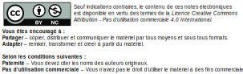

# Notes de cours sur l'intégration de l'électronique aux espaces immersifs

## Description

Cette ressource éducative libre (REL) regroupe des **notes de cours** sur l'intégration de l'électronique aux espaces immersifs dans un contexte de création multimédia. Elle traite de l’intégration de capteurs et actionneurs dans un grand espace où l'ordinateur multimédia, qui doit coordonner les aspects audiovisuels (les projections visuelles, les éclairages, les effets et les diffusions sonores), est distant.

Ces notes de cours peuvent être particulièrement utiles dans le cadre d'un cours d'enseignement supérieur dans une discipline qui traite d'art et d'électronique.

##  Version

Cette documentation est publiée sur un support adapté à la mise à jour et à la contribution par la communauté. 

**Toute personne est invitée à contribuer au code source à l'adresse suivante : [github.com/tim-montmorency/rel-electro-immersif](https://github.com/tim-montmorency/rel-electro-immersif)**.

La publication la plus à jour, c'est à dire celle en développement, sera toujours disponible à l'adresse suivante : [tim-montmorency.com/rel-electro-immersif](https://tim-montmorency.com/rel-electro-immersif/).

À des fins d'archivage, des versions statiques sont sporadiquement publiées :
* Version 1 (1 mars 2023) : [tim-montmorency.com/rel-electro-immersif/v1](https://tim-montmorency.com/rel-electro-immersif/v1).

## Format

Ces notes ont été formatées pour être directement projetées sur grand écran dans le cadre d'une classe. Les éléments visuels ont été privilégiés et le texte y est épuré et agrandi pour permettre une meilleure lecture de loin. 

Le contenu a été subdivisé en sections non imbriquées pour que le contenu soit plus accessible et servir de référence aux étudiants tout au long de leur formation ou par après.

**Il n'est pas recommandé d'imprimer ce document puisqu'il n'a pas été prévu pour cette utilisation et plusieurs fonctionnalités et avantages de ce format seront perdus.**


## Crédits

Ce projet a été initié en 2022 par [Thomas O Fredericks](http://t-o-f.info) avec la collaboration de Guillaume Arseneault, tous les deux professeurs au département de [Techniques d'intégration multimédia](https://www.cmontmorency.qc.ca/programmes/nos-programmes-detudes/techniques/techniques-dintegration-multimedia/description-du-programme/) du [Collège Montmorency](https://www.cmontmorency.qc.ca/).

Le suivi de projet au Collège Montmorency à été effectué par :
* Valérie Jacques, spécialiste en moyens et techniques d'enseignement aux affaires étudiantes.
* Géraldine Lussier, conseillère pédagogique au bureau de la réussite et de l'innovation pédagogique.

La réalisation de cette ressource a été rendue possible grâce à un financement de la [fabrique REL](https://fabriquerel.org/rel/).

## Licence



Pour citer cette première version de la REL, veuillez utiliser la formule suivante :

```Fredericks, T. O. et Arseneault, G. (2023). Notes de cours sur l’intégration de l’électronique aux espaces immersifs. Collège Montmorency. CC BY-NC.```


## Conventions de documentation

Les noms de variables qui sont destinées à être créées par l'utilisateur doivent être précédés de *mon* ou *ma* pour les différencier des noms réservés du langange de programmation.

Exemples :

```arduino
int maBrocheDel = 10;
```

```arduino
void monTraiterMessage( microOscMessage monMessageOsc ) {
	...
}
```

```arduino
MicroOsc monMicroOsc;
```


## Technologies utilisées pour la réalisation de cette ressource

* [mdBook](https://rust-lang.github.io/mdBook/) pour convertir les textes du format Markdown au format HTML.
* [GitHub Actions](https://docs.github.com/en/actions) pour automatiser le déploiement des fichiers sources au site [tim-montmorency.com/rel-electro-immersif](https://tim-montmorency.com/rel-electro-immersif/).
* [Fritzing](https://fritzing.org/) pour le dessins de circuits.
* Du JavaScript sur mesure pour ajouter automatiquement la description des figures sous celles-ci et pour ajouter une petite table des matières lorsque le contenu l'exige.
* [GLightbox](https://github.com/biati-digital/glightbox) pour permettre l'intégration de la lecture des vidéos directement dans le site.
