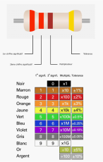

# Résistance

Une résistance est un composant électrique dont la principale caractéristique est d'opposer une plus ou moins grande résistance mesurée en ohms (Ω) à la circulation du courant électrique.

Une résistance est un milieu peu conducteur; les électrons peinent à s’y déplacer. Leur énergie se dissipe alors en général sous forme de chaleur. C’est ce principe utilisé pour les bouilloires électriques ou les ampoules à filaments.
La valeur de la résistance se mesure en ohms (Ω) et elle est déterminée par ses bandes de couleurs.

# Calculer la valeur d’une résistance

Pour connaître la valeur en ohms (Ω) d'une résistance,  il faut convertir le code couleur des 2 ou 3 premiers anneaux pour ensuite  multiplier par le code de l'anneau suivant. La tolérance, représentée par le dernier anneau, correspond à l’imprécision de la valeur en ohms. Plus elle est petite, plus la résistance est de meilleure qualité.

Exemple : rouge (2), rouge(2), brun (x10) = 22 * 10 = 220 Ω = 0.22 kΩ

