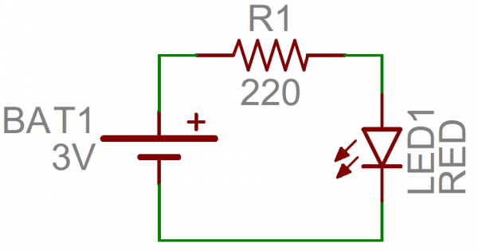
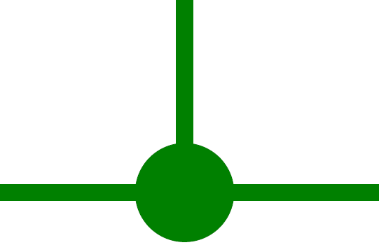
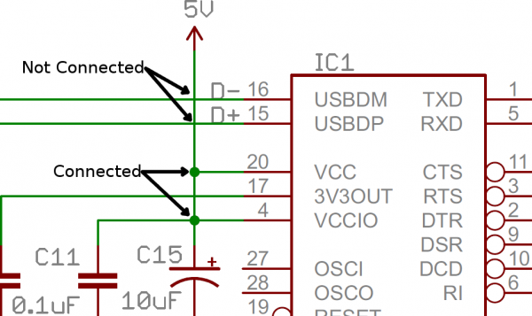
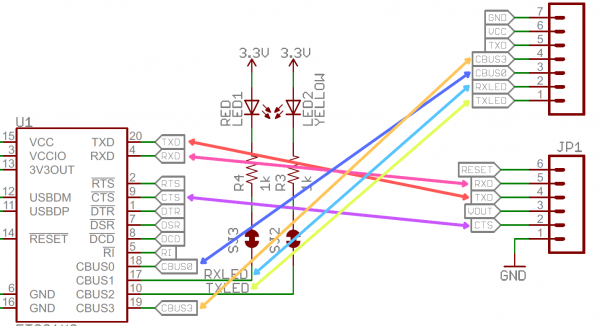
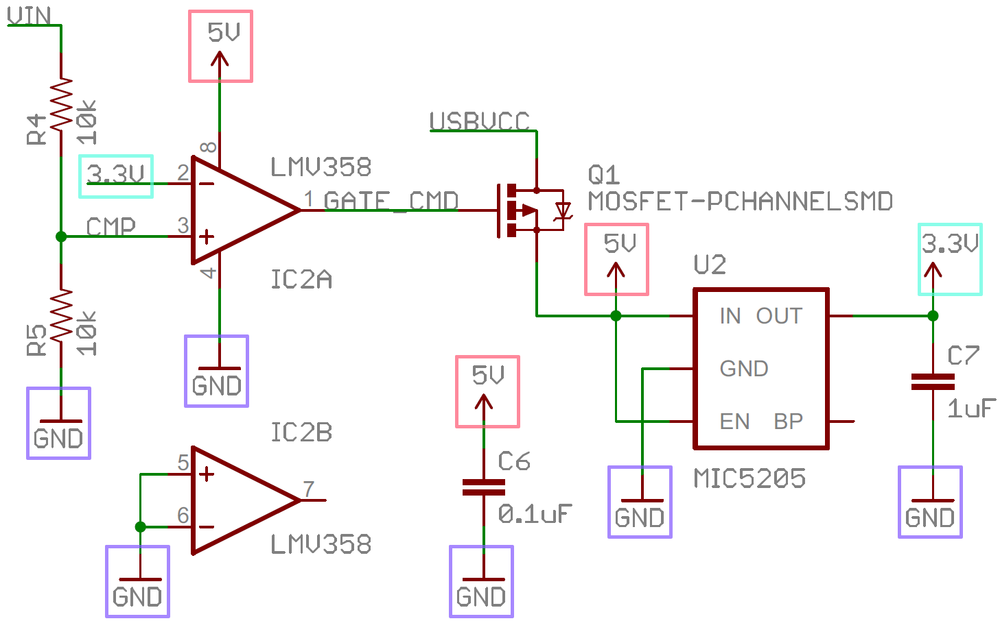

# Schémas de circuits

Un schéma de circuit est une représentation schématique de la connectique d’un circuit électrique. Les composants électriques sont représentés en tant que symboles pour faciliter leur reproduction et leur identification. Ce qui est important est de représenter comment les éléments sont reliés entre eux et non leur disposition exacte dans l’espace. 

## Jonctions

Chaque fil peut connecter deux terminaux ensemble, ou ils peuvent en connecter des dizaines. Lorsqu'un fil se divise en deux directions, on indique jonction. Nous représentons les jonctions sur des schémas avec des petits points placés à l'intersection des fils.

Les points de jonction  permettent d'indique que "les fils traversant cette jonction sont connectés". L'absence d'un point de jonction signifie que deux fils superposés ne font que passer, ne formant aucune sorte de connexion. Lors de la conception de schémas, il est généralement recommandé d'éviter ces chevauchements non connectés dans la mesure du possible, mais c'est parfois inévitable.

## Symboles d'alimentation

L'alimentation est souvent représentée sous une forme abstraite. Vous pouvez connecter des termineux à ces symboles, et ils seront directement liés à 5V, 3,3V, VCC ou GND (masse). 

Chaque alimentation est composée de deux pôles. L'un positif et l'autre négatif.

Les nœuds de tension positive sont généralement indiqués par une flèche pointant vers le haut.

Tandis que les nœuds de masse (GND ou 0V) impliquent généralement une ligne horizontale plate ou parfois une flèche ou un triangle pointant vers le bas.

Parfois, les symboles d'alimentation sont représentés avec les deux pôles regroupés, mais plus souvent ils sont représentés avec les deux pôles séparés pour faciliter la compréhension du schéma.

### Pôles regroupés

Les symboles suivants représentent les deux pôles d'une alimentation dans un même dessin.

### Pôles séparés

Les symboles suivants représentent les deux pôles d'une seule et même alimentation dans deux dessins séparés.

## «Net»

Parfois, pour rendre les schémas plus lisibles, nous donnons un nom à un «net» et l'étiquetons, plutôt que de faire passer un fil sur tout le schéma. Les «nets» portant le même nom sont supposés être connectés, même s'il n'y a pas de fil visible les reliant. Les noms peuvent soit être écrits directement sur le dessus du «net», soit ils peuvent être des «tags», accrochés au fil.

Les «nets» reçoivent généralement un nom qui indique spécifiquement le but des signaux sur ce fil. Par exemple, les «nets» électriques peuvent être étiquetés "VCC" ou "5V", tandis que les «nets» de communication série peuvent être étiquetés "RX" ou "TX".

## Identifier les nœuds d'alimentation

Les nœuds de tension sont des «nets» qui indiquent un niveau de tension spécifique. Tous les terminaux connectés à un nœud de tension portant le même nom sont connectés ensemble.

## Références et sources des images

* JIMBLOM. (s. d.). How to Read a Schematic. Sparkfun. [https://learn.sparkfun.com/tutorials/how-to-read-a-schematic](https://learn.sparkfun.com/tutorials/how-to-read-a-schematic)
