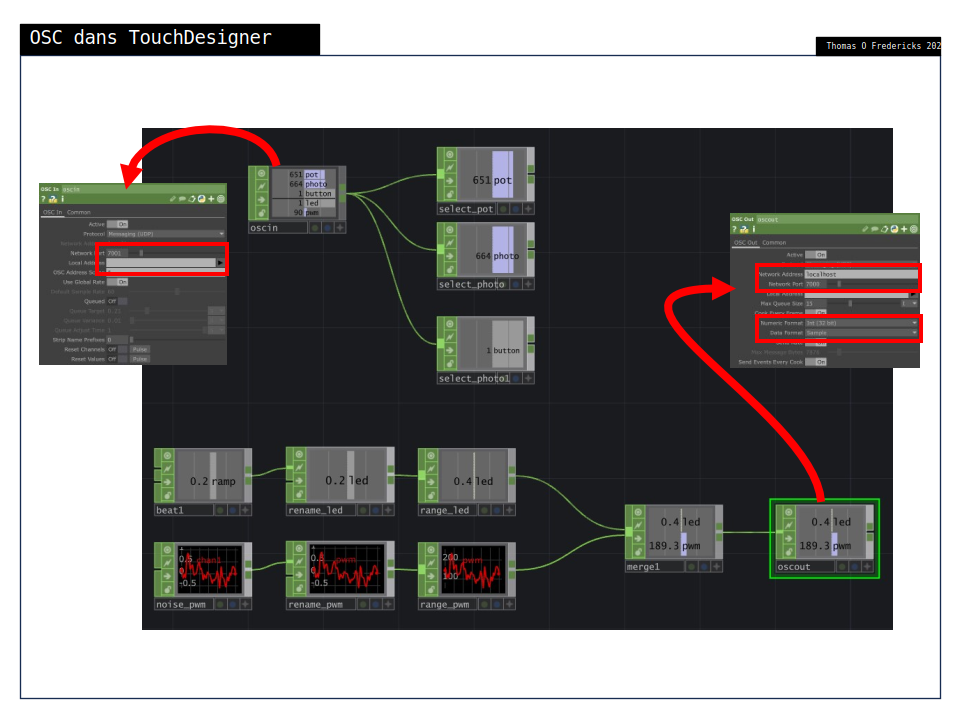

# OSC UDP avec TouchDesigner

## Installation de TouchDesigner

Le téléchargement du logiciel TouchDesigner (pour Windows et macOS) est disponible ici : [Download | Derivative](https://derivative.ca/download)

## Code pour traiter l'OSC UDP dans TouchDesigner

### Capture d'écran

### Téléchargement

* La document TouchDesigner peut être téléchargé ici : [td_osc_udp.toe](./td_osc_udp.toe)

