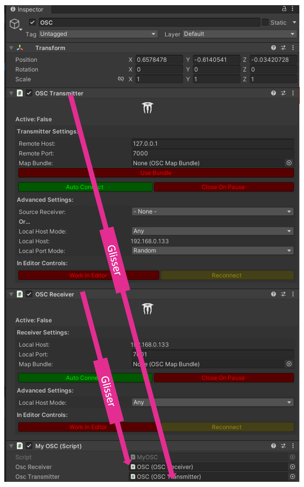
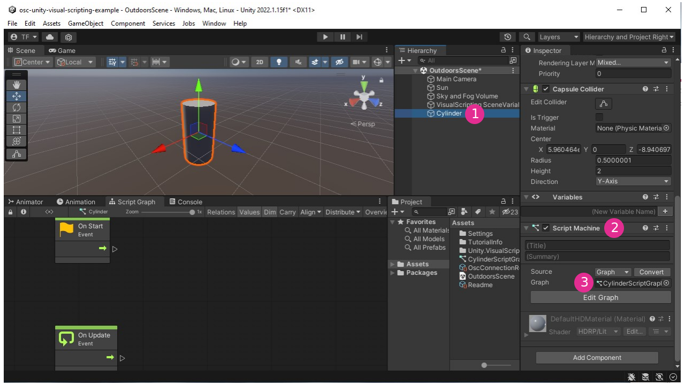

# OSC UDP : Unity

## Préalables

Pour envoyer de l'OSC UDP à Unity, vous devez utiliser l'une des solutions suivantes :
* **de préférence** un microcontrôleur avec une connexion WiFI ou Ethernet qui peut communiquer en UDP ; dans ce cas, vous pouvez utilisez [MicroOsc UDP](../osc_udp/osc_udp.md).
* **sinon** un microcontrôleur avec une connexion série ; dans ce cas, vous pouvez utilisez [MicroOsc SLIP](../osc_slip/osc_slip.md) ainsi qu'un logiciel permettant de faire le relais SLIP à UDP :  [relais avec PD](../pd/relais_osc_slip_udp.md) ou [relais avec Max](../max/relais_osc_slip_udp.md).

## Avant tout : Activez «Run in Background» dans Unity

Pour que Unity puisse continuer à rouler son code quand sa fenêtre n'est pas en avant plan, cochez la case «Run in Background» dans «Project Settings→Player→Resolution and Presentation→Run in Background» :


## Option #1 : Solution C# avec le paquet extOSC

### Installation

Trouvez «extOSC» dans l'[Asset Store](https://assetstore.unity.com/) (n'oubliez pas de vous connecter avec votre compte Unity avant) :


Cliquez le bouton pour ajouter «extOSC» à vos *assets* et cliquez de nouveau sur le bouton pour ouvrir l'*asset* dans Unity :


Téléchargez le paquet «extOSC» à partir du gestionnaire de paquet :


Cliquez le bouton pour importer le paquet «extOSC» :


Installez toutes les dépendances :


Importez tous les *assets* :


Vous devriez maintenant trouver *extOSC* dans vos *assets* :


### Intégration

* Créez un nouveau GameObject vide nommé «OSC».
* Ajoutez les scripts (qui viennent ave extOSC) «OSCTransmitter» et «OSCReceiver» en tant que *components* au GameObject «OSC».
* Configurez les components avec la configuration réseau.


Créez un nouveau script nommé «MyOSC» :


Dans ce script, indiquez que vous allez utiliser le paquet « extOSC » en ajoutant `using extOSC` au tout début (après les autres `using`) :
```csharp
using extOSC;
```

Ensuite, ajoutez deux variables qui pointeront vers les scripts *components* «OSCTransmitter» et «OSCReceiver» :
```csharp
public extOSC.OSCReceiver oscReceiver;
public extOSC.OSCTransmitter oscTransmitter;
```

Dans l'éditeur Unity liez ces variables aux scripts *components* «OSCTransmitter» et «OSCReceiver»:


Pour interagir avec les GameObjects dans la scène, vous devez aussi ajouter une variable publique au script «MyOSC» :
```csharp
public GameObject myTarget;
```

Dans Unity vous devez lier un GameObject de votre scène à la variable que vous vennez de créer:


Dans le script «myOSC», ajoutez cette méthode très utile qui permet d'adapter les échelles des valeurs (comme [scale] dans Max):
```csharp
 public static float ScaleValue(float value, float inputMin, float inputMax, float outputMin, float outputMax)
    {
        return Mathf.Clamp( ((value - inputMin) / (inputMax - inputMin) * (outputMax - outputMin) + outputMin), outputMin,outputMax);
    }
```

### Recevoir des messages OSC

Pour recevoir des messages OSC, vous devez ajouter un `Bind()` pour chaque adresse dans le `Start()` du script «myOSC»:
```csharp
// Mettre cette ligne dans la méthode start()
oscReceiver.Bind("/adresse", TraiterMessageOSC);
```

Vous devez ensuite définir la fonction `TraiterMessageOSC()` qui va être appelée quand un message OSC avec l'adresse définie avec le `Bind()` est reçu:
```csharp
void TraiterMessageOSC(OSCMessage oscMessage)
{
    // Récupérer une valeur numérique en tant que float
    // même si elle est de type float ou int :
    float value;
    if (oscMessage.Values[0].Type == OSCValueType.Int )
    {
        value = oscMessage.Values[0].IntValue;
    } else if (oscMessage.Values[0].Type == OSCValueType.Float)
    {
        value = oscMessage.Values[0].FloatValue;
    } else
    {
        // Si la valeur n'est ni un foat ou int, on quitte la méthode :
        return;
    }
    
    // Changer l'échelle de la valeur pour l'appliquer à la rotation :
    float rotation = ScaleValue(value, 0, 4095, 45, 315);
    // Appliquer la rotation au GameObject ciblé :
    myTarget.transform.eulerAngles = new Vector3(0,0,rotation);
}
```

### Envoyer des messages OSC

Pour envoyer des messages OSC, vous devez avant tout créer une proprité dans la classe «myOSC» pour mesurer le temps et ralentir l'envoi des messages qui peut être beaucoup trop rapide:
```csharp
// Variable utilisée pour contrôler la vitesse d'envoi des messages :
 float myChronoStart;
```

Ensuite, vous ajoutez une méthode `LateUpdate()` à la classe «myOSC» (nous utilisons `LateUpdate()` plutôt que `Update()` parce que nous voulons que la méthode soit appelée en dernier):
```csharp
// LateUpdate is called once per frame after Update
void LateUpdate()
{
    // Si 50 millisecondes se sont écoulées depuis le dernier envoi :
    if (Time.realtimeSinceStartup - myChronoStart >= 0.05f ) 
    {
        myChronoStart = Time.realtimeSinceStartup;

        // Créer le message
        var myOscMessage = new OSCMessage("/adresse");

        
        // Aller chercher une valeur:
        float myPositionX = myTarget.transform.position.x;
        // Changer l'échelle de la valeur:
        float myScaledPositionX = ScaleValue(myPositionX, -7, 7, 0, 255);

        // Ajouter la valeur au message
        myOscMessage.AddValue(OSCValue.Int( (int) myScaledPositionX) ); // Le (int) entre parenthèses convertit le type.

        // Envoyer le message
        oscTransmitter.Send(myOscMessage);
    }
  
}
```

À noter que tous vos envois de messages doivent se faire dans cette fonction `LateUpdate()`!

Si vous voulez envoyer des `float` , utilisez la méthode suivante :
```csharp
myOscMessage.AddValue(OSCValue.Float( (float) valeur) ); // Le (float) entre parenthèses convertit le type.
```


### Exemple complet

Vous trouverez un exemple complet à l'adresse suivante : [thomasfredericks/unity_extosc_example: Example for the integration of extOSC in Unity](https://github.com/thomasfredericks/unity_extosc_example)

Vous pouvez tester la communication OSC avec le patcher Max suivant : [osc_slip_udp.maxpat](./osc_slip_udp.maxpat)

##  Option #2 : Solution Visual Scripting avec le paquet OSCJackVS

Nous utilisons [OSCJackVS](https://github.com/keijiro/OscJackVS) de Keijiro pour traiter les messages OSC UDP dans Unity.

Voici l'information à inscrire dans les paramètres du gestionnaire de paquets (voir figure ci-bas) :
* Name: `Keijiro`
* URL: `https://registry.npmjs.com`
* Scope: `jp.keijiro`


### Assignation du message /pot à la rotation d'un cylindre



