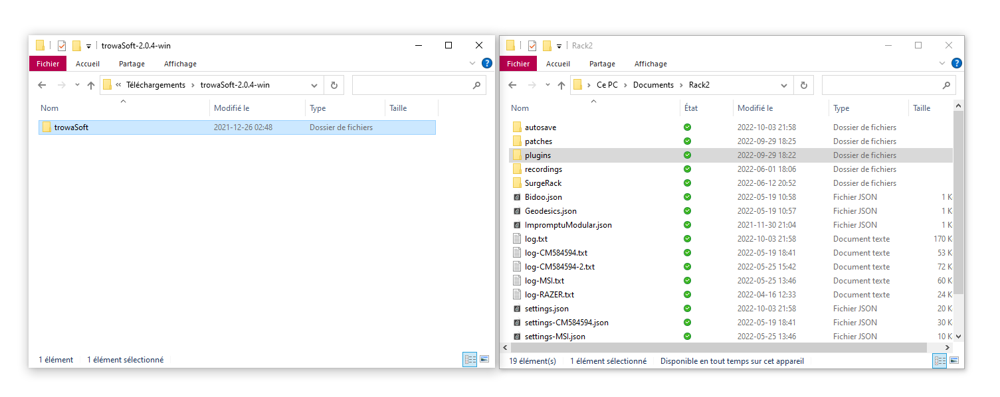
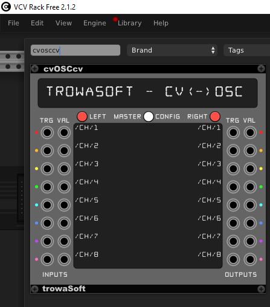

# OSC avec VCV Rack

Il existe quelques modules OSC pour VCV Rack, mais nous trouvons que le module **cvOSCcv** est le plus configurable. 

## Installation de cvOSCcv

En date du 4 octobre 2022, le module **cvOSCcv** n'est plus disponible dans le [gestionnaire de librairies de VCV Rack](https://library.vcvrack.com/). 

Heureusement, l'adaption pour la version 2 est mode béta sur le [GitHub de cvOSCcv](https://github.com/j4s0n-c/trowaSoft-VCV/releases). Ouvrez la section *Assets* de la dernière version (*release*) et téléchargez la version pour votre OS.

Pour installer **cvOSCcv**, copiez le dossier *trowaSoft* dans le dossier *plugins* des documents de VCV Rack 2 (*Vos Documents > Rack2 > plugins*).

Redémarrez VCV Rack et vous devriez trouver **cvOSCcv** dans la liste des modules:

### Configuration de cvOSCcv

