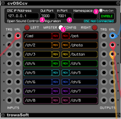
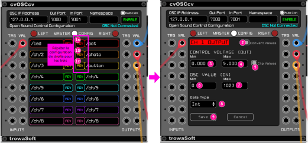
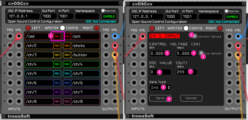
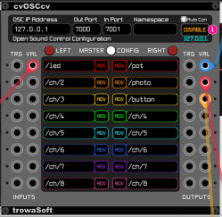
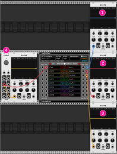

# OSC avec VCV Rack

Il existe quelques modules OSC pour VCV Rack.  Le module **cvOSCcv** est privilégié pour sa configurabilité. 

## Installation de cvOSCcv

Le module **cvOSCcv** est disponible dans [VCV Library](https://library.vcvrack.com/?query=cvosccv&brand=&tag=&license=).

### Configuration de cvOSCcv

