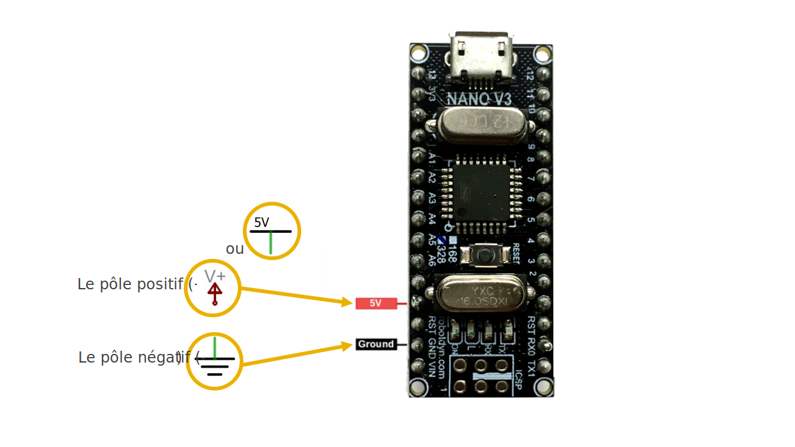

# Alimentation platine d'expérimentation

## Se servir d'une carte Arduino pour alimenter une platine d'expérimentation

### Pôles de la carte Arduino Nano

Sur certains modèles de carte Arduino Nano, le pôle positif (+) n’est malheureusement pas imprimé sur la carte. Cependant, on retrouve dans la documentation des broche que c’est la broche au dessus de l'étiquette «RST». 

Le pôle négatif (-) est indiqué avec l'étiquette «GND» imprimée sur la carte. 

### Étape 1

Branchez un câble (orange ou rouge) dans la rangée de la broche du positif (+) de la carte Arduino. Ce câble transporte maintenant le positif (+).

Branchez un câble (brun ou noir) dans la rangée de la broche du négatif (-) de la carte Arduino. Ce câble transporte maintenant le négatif (-)

### Étape 2

Brancher le câble qui transporte le positif (+) dans la colonne + rouge de la platine d’expérimentation.

Brancher le câble qui transporte le négatif (-) dans la conne – bleue de la platine d’expérimentation.

### Étape 3

Reliez les deux autres colonnes de la patine d'expériementation.

